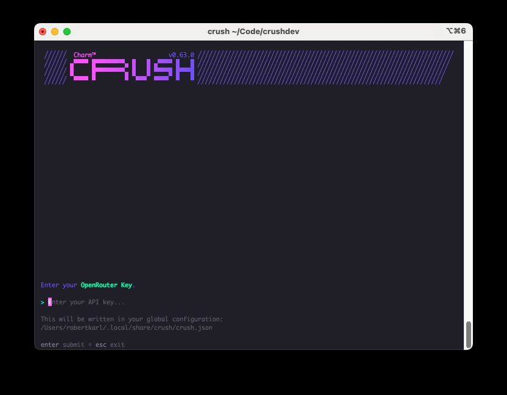

# the thesis

An app that bundles 

a) llmfit
b) a polished MacOS coding UI like Cursor or Codex (or maybe even Claude Code)
c) One-click install as Steve Jobs intended -- bundle the model.
d) Decent model llama-server defaults

would be generally useful.

# what exists

The following is from a convo with Claude about this topic:

  hf agents run pi (HuggingFace) — uses llmfit to scan your hardware, auto-picks the right model/quant, downloads it, starts inference, launches a coding agent. One command. This
  is the most integrated thing that exists.

  Tier 1: Almost there

  ┌─────────────────────────┬────────────────┬──────────────────┬──────────────────┬──────────────────┐
  │         Product         │ Bundles model? │ Auto-detects HW? │   Agent tools?   │    One-click?    │
  ├─────────────────────────┼────────────────┼──────────────────┼──────────────────┼──────────────────┤
  │ hf-agents + Pi          │ Auto-downloads │ YES (llmfit)     │ File R/W, shell  │ Close            │
  ├─────────────────────────┼────────────────┼──────────────────┼──────────────────┼──────────────────┤
  │ Ollama 0.18.3 + VS Code │ ollama pull    │ Partial          │ YES (agent mode) │ 2 commands       │
  ├─────────────────────────┼────────────────┼──────────────────┼──────────────────┼──────────────────┤
  │ Bodega One              │ No (BYOM)      │ No               │ YES              │ Desktop app, $79 │
  └─────────────────────────┴────────────────┴──────────────────┴──────────────────┴──────────────────┘

  Tier 2: Great agents, you bring the model

  OpenCode (147K stars), Crush (Charmbracelet), Aider, Cline, Kilo Code, Roo Code, Goose, Open-Codex fork — all support Ollama/local endpoints, all have tool-calling. None bundle
  the model or auto-detect your hardware.

  The gap is still real

  Nobody ships one binary that does all four things:
  1. Detect hardware/RAM
  2. Download the right model
  3. Serve it with sane defaults (context size, no thinking tokens)
  4. Run a coding agent with tools

  hf agents run pi is the closest — but it's a Python CLI, not a polished desktop app. The "Cursor but local" product still doesn't exist as a one-click thing.

  The interesting tool is llmfit (11.7K stars) — it's the missing "which model fits my hardware" piece that everything else lacks. But it's a standalone recommender, not
  integrated into an agent.

## the 'pi' coding harness experience

For local development, it's not smooth getting started with pi. The documentation doesn't treat it as a first class citizen (it's more about hooking it up to your cloud providers). It's not built with a lot of opinions about coding for small models... it's just not designed for that. it's a minimal coding harness.

The first hour is miserable. If you go from a new macbook, to downloading pi? it's horrendous because the docs are bad and you don't have the agent running yet to help you set itself up. (this appears to be a common use case for pi: launch it and have pi customize itself for your use case).

So you start by configuring and launching llama-server. So we're back to failing at all 4 points from the top of this markdown file: no llmfit/no polished app/no one-click install/no decent llama-server defaults.

It took me about an hour to get to a point where I was able to make changes to pi's configuration with pi using Qwen 9B oblit.

In my opinion, this kind of configuration being required, in particular the need to figure out how to run llama-server (which has a lot of footguns depending on the specific hardware) is a hard blocker. Pi ain't it for the Cinderella use case.

## crush
charmbraclet/crush on github.

I have a crush on how slick their UI looks. but this ain't it either... their default config experience is cloud-native.

