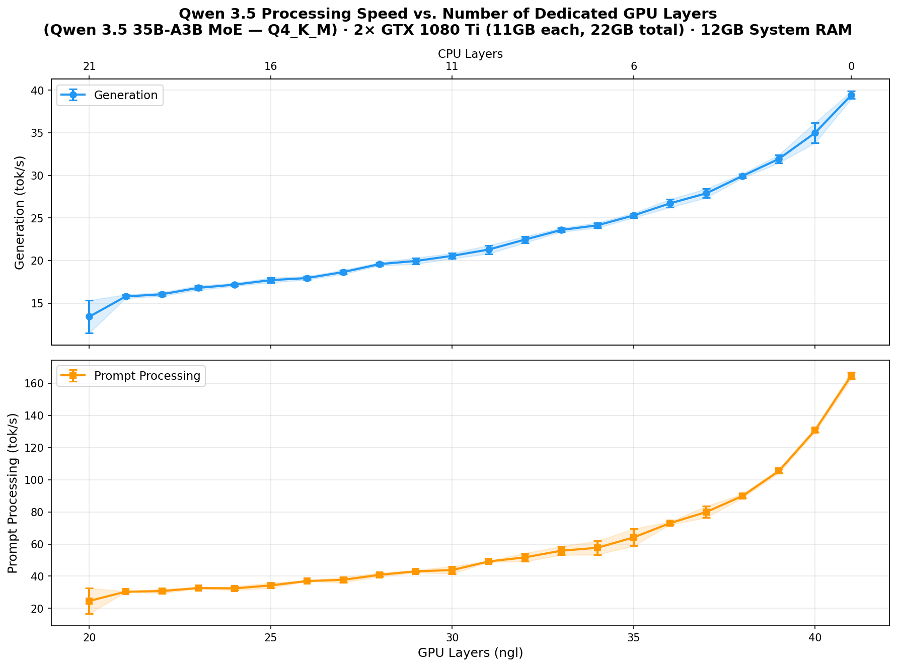

# What is this

Cinderella makes small, open-weights models like Qwen 3.5 9B capable of performing
meaningful work on modern Macs (Apple Silicon / 18GB+ unified RAM).

On more capable machines with more unified memory, Cindy picks the "LLM that fits perfectly" and is even more capable.

# Tenets

- Small models are capable of performing meaningful development and testing work
- Small models need more guardrails, guidance, and constraints. A Claude Code-style interface doesn't work well with a 9B param model due to their relative lack of skill with dealing with ambiguity.
- Nobody has executed yet an open source / open weights harness with taste, judgement and tuning. We are talking sensible engineering tradeoffs, a slick UI and no fiddling with llama_serve parameters or quantizations (to cite just two knobs) to get started with excellent results.

# development goals

- Combine open source tools like llama_server and open weights models (currently focused on the Qwen family to constrain tool call work) into one already configured package
- Provide a library of runbooks, templates, or skills. Call them what you will; these act as guides or guardrails to keep 9B on track.
- Do the prompt engineering work with diligence. This is actually more important on small models (citation needed) due to hallucinations with conflicting instructions and the small context sizes in use.
- Define through iteration and tinkering the proper U/X for getting excellent results out of small language models (hint: it's not a Claude-code style repl).


# What exists already / doesn't exist

I see four components that should be bundled (this is discussed in DEV-GOALS md also)

1) What LLM fits on my hardware? there is the widely popular [llmfit](https://github.com/AlexsJones/llmfit) for this.
2) There is the harness. pi and opencode partially solve this. But a polished MacOS coding UI? I don't know of one.
3) local models have different strengths and weakness. ambiguity is tough. Need good prompting. Superpowers/gstack/gauntlette should be the default experience, especially with smaller models. Also, need reasonable llama-server params like temperature.
4) One-click install. No more fiddling with params. Nothing nails this either.

Aspirationally, Cinderella or Cindy bundles all of this stuff into one beautiful MacOS application.


# notes from 4-26

the following graph shows the 'cliff' as tokens/second drops when using a MoE model with some layers offloaded to CPU RAM.

The implication here is that MoE models may be more capable than dense models if only partially accelerated on the GPU....




# Cindy in action

The following is a transcript of Cindy debugging a Flask app that has deliberately been configured to emit a 503 1/3 of the time.


```
     Running `target/debug/cinderella . -p 'debug connectivity to http://localhost:14094. periodic failures are seen about 1/3 of the time.' --playbook network-debug --model /Users/robertkarl/models/Qwen3.5-9B-Q5_K_M.gguf`
Hardware: Apple M3 Pro · 18 GB unified · 2.7 GB available
Model: /Users/robertkarl/models/Qwen3.5-9B-Q5_K_M.gguf (user-provided)
Starting llama-server...
✓ Health check: ok

  bash dig localhost
  |
  | ; <<>> DiG 9.10.6 <<>> localhost
  | ;; global options: +cmd
  | ;; Got answer:
  | ;; ->>HEADER<<- opcode: QUERY, status: NOERROR, id: 14392
  |
  | ...(15 more lines, but truncated to 100 lines.)

  DNS resolution succeeds. localhost resolves to 127.0.0.1. Now checking connectivity.

  bash ping -c 3 -W 2 localhost
  | PING localhost (127.0.0.1): 56 data bytes
  | 64 bytes from 127.0.0.1: icmp_seq=0 ttl=64 time=0.079 ms
  | 64 bytes from 127.0.0.1: icmp_seq=1 ttl=64 time=0.224 ms
  | 64 bytes from 127.0.0.1: icmp_seq=2 ttl=64 time=0.205 ms
  |
  |
  | ...(3 more lines, but truncated to 100 lines.)

  Ping succeeds with low latency. Now checking port 14094.

  bash curl -v --connect-timeout 5 http://localhost:14094
  | Service temporarily unavailable
  | * Host localhost:14094 was resolved.
  | * IPv6: ::1
  | * IPv4: 127.0.0.1
  |   % Total    % Received % Xferd  Average Speed   Time    Time     Time  Current
  |
  | ...(19 more lines, but truncated to 100 lines.)

  Connection succeeds but returns 503 SERVICE UNAVAILABLE. The service is running but returning errors. Let me check the status code and run multiple requests to see if it's intermittent.

  bash curl -s -o /dev/null -w '%{http_code}\n' http://localhost:14094
  | 200

  Interesting - got 200 this time. Let me run multiple requests to detect the intermittent pattern.

  bash for i in $(seq 1 10); do curl -s -o /dev/null -w "%{http_code} " http://localhost:14094; done; echo
  | 200 503 200 200 503 200 200 503 200 200

  Confirmed - the pattern is intermittent 503 errors (about 30% failure rate as reported). Let me check the headers on a 503 response to understand what's happening.

  bash curl -s -D - http://localhost:14094 2>&1 | head -20
  | HTTP/1.1 503 SERVICE UNAVAILABLE
  | Server: Werkzeug/3.1.8 Python/3.12.13
  | Date: Thu, 30 Apr 2026 23:19:51 GMT
  | Content-Type: text/html; charset=utf-8
  | Content-Length: 31
  |
  | ...(3 more lines, but truncated to 100 lines.)

  bash curl -s -D - http://localhost:14094 2>&1 | head -20
  | HTTP/1.1 200 OK
  | Server: Werkzeug/3.1.8 Python/3.12.13
  | Date: Thu, 30 Apr 2026 23:19:54 GMT
  | Content-Type: text/html; charset=utf-8
  | Content-Length: 16
  |
  | ...(3 more lines, but truncated to 100 lines.)

  ## Diagnosis

**What's working:**
- DNS resolution (localhost → 127.0.0.1)
- Network connectivity (ping succeeds)
- TCP connection to port 14094 (Werkzeug/Python server is running)

**What's broken:**
- Intermittent 503 SERVICE UNAVAILABLE responses (~30% failure rate)
- The service is a Python/Werkzeug application that's experiencing periodic failures

**Root cause:**
The application itself is failing to handle requests properly. This is likely due to:
- Application-level issues (thread pool exhaustion, resource limits, or bugs)
- The server is running but not handling all requests successfully

**Recommended fix:**
1. Check application logs for errors during 503 responses
2. Review application configuration (thread pool size, worker limits)
3. Restart the application to clear any stuck state
4. Check for resource constraints (memory, CPU)
```
