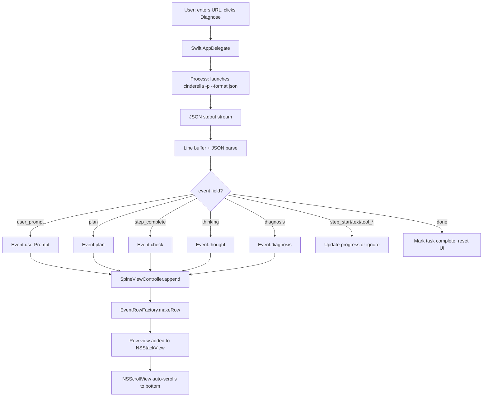
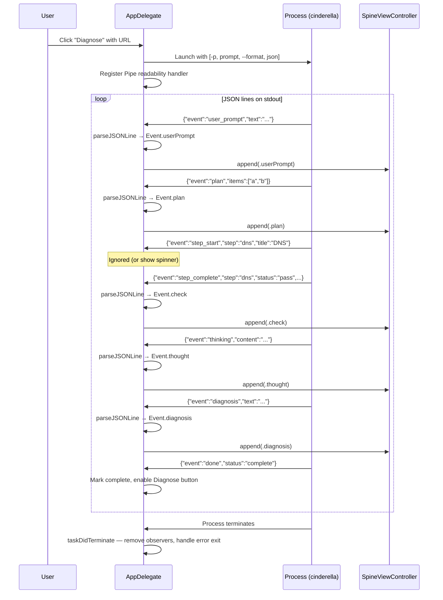

# Beautify — Glass Slipper Visual Polish

Created by /gauntlette-start on 2026-04-30
Branch: master (feature name: beautify) | Repo: cinderella
Design doc: /Users/robertkarl/.gauntlette/designs/cinderella/beautify-design-20260430-224634.md

## Problem Statement

Glass Slipper has a working ObjC rendering layer (fixed-height table rows, no visual differentiation between event types) and a Swift scaffold with a complete design system that's 80% done but not wired in. The React mock from Claude.ai shows the target: status pills, plan bullets, italic thoughts, emerald diagnosis card. Finish the scaffold, port to Swift, wire it in.

## Vision

Glass Slipper needs to be screenshot-worthy — the kind of native macOS app that makes people on HN say "why doesn't everything look like this?" Right now it's a working diagnostic tool with the visual sophistication of a log viewer. The React mock proves the target is achievable: status pills, plan bullets, italic asides, an emerald diagnosis card. A Swift scaffold already maps the mock's Tailwind palette to AppKit tokens and has 2 of 5 row views working. This feature finishes the last 20% of the visual layer and eliminates the ObjC/Swift split so future work is one-language.

## Planning Mode

BUILDER — side project, craft-driven. Interview focused on visual target (React mock), audience (demo video + HN screenshots), and scope (finish stubs + port to Swift). Waterfalls and dashboards noted as 10x vision, explicitly deferred.

## Feature Spec

Five event types, each with distinct visual treatment matching the React mock:

1. **UserPromptRowView** — zinc-100 background header bar. Leading arrow glyph, prompt text, trailing "Investigate" button. Already implemented in scaffold.
2. **PlanRowView** — "PLAN" header in small uppercase (sectionHeader font, textSecondary), followed by bulleted list of items. Each bullet is a 1.5pt circle (textQuiet) + detailText label. NSStackView for items.
3. **CheckRowView** — Status pill (OK/WARN/ERR) + bold title + detail text. Already implemented in scaffold.
4. **ThoughtRowView** — surfaceMuted background. "..." prefix in textQuiet + italic body in textSecondary. Tighter vertical padding than CheckRow (Spacing.lg not rowVertical).
5. **DiagnosisRowView** — surfaceDiagnosis (emerald-50) background. 4pt emerald left border. "DIAGNOSIS" header (diagnosisLabel font, accentDiagLabel color, uppercase, kerned). Body in diagnosisText / textPrimary. Generous vertical padding.

Port AppDelegate to Swift: NSTask lifecycle, NSPipe stdout/stderr handling, JSON line parsing, event dispatch to SpineViewController.

## Scope

| Item | Decision | Effort | Why |
|------|----------|--------|-----|
| PlanRowView implementation | ACCEPTED | S | Empty stub with TODO spec |
| ThoughtRowView implementation | ACCEPTED | S | Empty stub with TODO spec |
| DiagnosisRowView implementation | ACCEPTED | S | Empty stub with TODO spec |
| Port AppDelegate to Swift | ACCEPTED | M | One language going forward |
| Wire SpineViewController as main UI | ACCEPTED | S | Replace NSTableView with scroll+stack |
| Remove ObjC rendering files | ACCEPTED | S | Clean up after port |
| Per-row actions (re-run, copy) | DEFERRED | M | Transmission-style, future work |
| Dark mode | DEFERRED | S | Swap token sets later |
| Waterfall charts | DEFERRED | L | 10x vision feature |
| Dashboard creation from agent ops | DEFERRED | XL | 10x vision feature |
| Streaming live-update rows | DEFERRED | M | Already partially works via text delta |
| Enrich Rust JSON protocol | ACCEPTED | S | user_prompt (echo input), plan (hardcoded runbook steps), diagnosis (from synthesis StepComplete). ~40 LOC across agent.rs + tui.rs. Must update both json_event() and print_event(). |
| JSONL debug logging | ACCEPTED | XS | Port glass-slipper.jsonl writing to NSTemporaryDirectory for tail -f debugging |
| Click-to-copy row text | ACCEPTED | S | NSStackView rows need click handler → NSPasteboard. ObjC used tableViewSelectionDidChange:. |
| Fix pipe drain race | DEFERRED | XS | Match ObjC behavior, document as tech debt |

## Resolved Decisions

| Decision | Why | Rejected |
|----------|-----|----------|
| Full Swift port (not hybrid bridge) | One language going forward, cleaner for future features | Hybrid ObjC/Swift bridge — works but two languages |
| React mock as visual spec | Already mapped to tokens in scaffold, verified by screenshot | Transmission-exact clone — inspiration not literal target |
| Light mode only | Ship fast, dark mode is a token swap later | Dark mode in v1 |
| Keep NSScrollView+NSStackView spine | ~20 events max, no need for NSTableView cell reuse | NSTableView with reuse — premature optimization |
| Port must handle taskDidTerminate race | ObjC code documents a race where final stdout chunk can be dropped if termination handler fires first; Swift port must drain pipe before removing observers | Ignoring the race — would silently lose the diagnosis row |
| Enrich Rust JSON protocol (not heuristic mapping) | Scaffold Event enum needs user_prompt/plan/diagnosis event types; adding ~40 LOC to Rust is cleaner than heuristic Swift translation. user_prompt echoes input, plan is hardcoded runbook, diagnosis wraps synthesis StepComplete. | Heuristic mapping (fragile), redesign Event enum (loses mock fidelity) |
| Plan event is hardcoded runbook, not LLM-extracted | The agent doesn't produce a structured "plan" — the runbook steps are static. Hardcoding step names is honest and reliable. LLM extraction would be fragile and the plan items would just be the runbook steps anyway. | LLM plan extraction (fragile, ~100 LOC, same output) |
| @main entry point (not main.swift) | Idiomatic Swift, compiler generates entry point, avoids top-level-code footgun | C-style main.swift with top-level code |
| Separate AppDelegate.swift file | Scaffold is design system + views; process management is a separate concern | Single 800+ line CinderellaScaffold.swift |
| Defer pipe drain fix (match ObjC) | User chose to port existing behavior; race is documented tech debt | Fix the race in the port (~5 LOC) |
| Wire smoke test as checkpoint 1 | Hardcoded events verify views render before subprocess wiring is added | Manual-only testing, XCTest snapshot tests |

## Codebase Health

STATUS: HEALTHY

- Stack: Rust (agent core), Swift + ObjC (Glass Slipper GUI), AppKit
- Structure: Clean separation between agent core and GUI app
- Test coverage: None in Glass Slipper. Rust core has some test fingerprints but no test files.
- Documentation: Good inline comments in scaffold (design system rationale, THE ONE RULE)
- Dependency freshness: N/A for GUI (AppKit only)
- Git hygiene: Clean master, shipped feature branches (init, cocoa, glass-slipper)

## Relevant Code

Files to read/modify:
- `glass-slipper/CinderellaScaffold.swift:377-410` — PlanRowView, ThoughtRowView, DiagnosisRowView stubs
- `glass-slipper/CinderellaScaffold.swift:414-496` — SpineViewController (working, needs to become main UI)
- `glass-slipper/main.m:1-546` — Full ObjC AppDelegate to port
- `glass-slipper/AppDelegate.h` — ObjC interface to port
- `glass-slipper/DiagnosticStepCell.m` — ObjC cell to replace
- `glass-slipper/DiagnosticStepCell.h` — ObjC cell header
- `glass-slipper/GlassSlipper-Bridging-Header.h` — May be removed after full port
- `glass-slipper/GlassSlipper.xcodeproj/project.pbxproj` — Build configuration

Key types in scaffold:
- `Event` enum (line 155) — maps to JSON event types
- `EventRowFactory` (line 221) — switch on Event to create row views
- `SpineViewController` (line 414) — scroll+stack spine, append() method
- Color/font/spacing tokens (lines 55-122) — mapped from React mock's Tailwind

## Relevant Design History

- `glass-slipper-design-20260430-165522.md` — Original Glass Slipper design (shipped the ObjC version)
- `cocoa-design-20260430-122556.md` — Cocoa phase design (agent core + AppKit deferred)
- This design supersedes the visual layer of glass-slipper design

## Open Wounds

- PlanRowView, ThoughtRowView, DiagnosisRowView are empty `init` bodies — they render as invisible zero-height views
- The ObjC and Swift code coexist but don't interact yet (scaffold is standalone)
- `DiagnosticStepCell.m` has a completely different visual style from the scaffold

## Tech Debt

- `TODO: small uppercase "PLAN" header` — PlanRowView stub (line 380)
- `TODO: surfaceMuted bg, "..." prefix` — ThoughtRowView stub (line 391)
- `TODO: surfaceDiagnosis bg. 4pt left edge` — DiagnosisRowView stub (line 402)
- `TODO_FILL_AFTER_DOWNLOAD` in src/config.rs:34 (unrelated)
- `TODO: wire TUI confirmation flow` in src/tools/bash.rs:167 (unrelated)

## Out of Scope

- Per-row actions (cancel, retry, re-run) — Transmission inspiration, future
- Waterfall charts for agent operations — 10x vision
- Dashboard creation from diagnostic data — 10x vision
- Dark mode — future token swap
- Streaming live-update of in-progress rows — partially works, polish later
- CLI (tui.rs) beautification — separate feature

## Architecture

### Mermaid: Architecture



### Mermaid: Data Flow



### ASCII: Architecture

```
User clicks "Diagnose"
    |
    v
Swift AppDelegate (AppDelegate.swift, @main)
    |-- creates NSWindow, URL field, Diagnose button
    |-- launches cinderella via Process
    |-- reads stdout via Pipe (readabilityHandler or notification)
    |-- buffers lines, parses JSON {"event":"...", ...}
    |
    v
JSON event dispatch:
    "user_prompt" → Event.userPrompt(text)      → UserPromptRowView
    "plan"        → Event.plan(items)            → PlanRowView
    "step_complete" → Event.check(name,status,detail) → CheckRowView
    "thinking"    → Event.thought(text)          → ThoughtRowView
    "diagnosis"   → Event.diagnosis(text)        → DiagnosisRowView
    "step_start"  → ignored (or progress)
    "text"        → ignored (step_complete has summary)
    "tool_start"  → ignored
    "tool_done"   → ignored
    "done"        → reset UI state
    "warning"     → NSLog
    |
    v
SpineViewController.append(event)
    |-- EventRowFactory.makeRow(for: event)
    |-- adds row NSView to NSStackView
    |-- auto-scrolls NSScrollView
```

### Failure Matrix

| Failure | Trigger | User sees | Logs | Plan handles? |
|---------|---------|-----------|------|---------------|
| cinderella binary not found | Missing from PATH, cargo target, and app-adjacent | Alert: "cinderella not found" | NSLog path search | YES — findCinderella ported from ObjC |
| cinderella exits non-zero | Bad model path, crash | Error row appended to spine | stderr dumped | YES — taskDidTerminate checks exit code |
| Invalid JSON line | Rust panic output, non-JSON stderr leak to stdout | Line skipped | NSLog "invalid JSON" | YES — processJSONLine guards |
| Final stdout chunk dropped | termination handler fires before last notification | Diagnosis row missing | None (silent) | DEFERRED — matches ObjC behavior, documented tech debt |
| Process hangs | Model download stalls, llama-server unresponsive | UI stuck on last step, Diagnose button shows "Stop" | None | YES — Stop button sends SIGTERM, 3s SIGKILL fallback |
| Unknown event type | Future protocol additions | Ignored | Optional NSLog | YES — default case in switch |
| UTF-8 decode failure | Corrupt pipe data (rare) | Line skipped | NSLog "UTF-8 decode failed" | YES — guard in processLineBuffer |

### Test Matrix

```
Component             | Happy Path | Error Path | Edge Cases | Integration
──────────────────────┼────────────┼────────────┼────────────┼────────────
PlanRowView           |   □ smoke  |     —      |  0 items   |     —
ThoughtRowView        |   □ smoke  |     —      |  empty str |     —
DiagnosisRowView      |   □ smoke  |     —      |  long text |     —
UserPromptRowView     |   □ smoke  |     —      |     —      |     —
CheckRowView          |   □ smoke  |     —      |     —      |     —
Swift AppDelegate     |     —      |  no binary |     —      |  □ e2e demo
JSON line parser      |     —      |  bad JSON  |  partial   |     —
Process management    |     —      |  non-zero  |  SIGTERM   |  □ e2e demo
Rust protocol changes |     —      |     —      |     —      |  □ e2e demo
```

Smoke = hardcoded events from scaffold comment block (checkpoint 1).
e2e demo = full run with demo/flask_503.py (checkpoint 3).

## Implementation Approaches

### Approach A: Hybrid bridge
Keep ObjC AppDelegate, swap rendering to Swift SpineViewController.
Effort: S | Risk: Low | Completeness: 8/10
Reuses: All ObjC code, adds adapter only.

### Approach B: Full Swift port (chosen)
Port AppDelegate to Swift. One language, one codebase.
Effort: M | Risk: Medium | Completeness: 9/10
Reuses: Swift scaffold design system, all token/view code.

### Recommended
Approach B — user chose one language. Port risk is moderate (NSTask/Pipe/JSON are well-documented Swift APIs). Visual payoff is the same either way; the win is codebase coherence for future features.

## Implementation

### Files to modify

| File | What | Notes |
|------|------|-------|
| `glass-slipper/CinderellaScaffold.swift` | Implement PlanRowView (line 377), ThoughtRowView (line 388), DiagnosisRowView (line 399) | Follow CheckRowView pattern. Tokens only, no literals. |
| `glass-slipper/AppDelegate.swift` | **NEW** — Swift AppDelegate with @main, window setup, Process management, JSON parsing, event dispatch | Port from main.m. Separate file from scaffold. |
| `glass-slipper/GlassSlipper.xcodeproj/project.pbxproj` | Remove ObjC sources from build, add AppDelegate.swift, remove bridging header setting | Must remove SWIFT_OBJC_BRIDGING_HEADER from target configs. |
| `glass-slipper/Info.plist` | No change needed | NSPrincipalClass stays NSApplication (compatible with @main). |
| `src/tui.rs` | Add user_prompt, plan, diagnosis event types to json_event() | ~30 LOC. New match arms in json_event function. |
| `src/agent.rs` | Add UserPrompt/Plan/Diagnosis variants to AgentEvent enum | Extend existing enum. |

### Files to remove (after port verified)

- `glass-slipper/main.m` — replaced by AppDelegate.swift with @main
- `glass-slipper/AppDelegate.h` — ObjC interface, no longer needed
- `glass-slipper/DiagnosticStepCell.m` — replaced by scaffold row views
- `glass-slipper/DiagnosticStepCell.h` — ObjC header
- `glass-slipper/GlassSlipper-Bridging-Header.h` — no ObjC to bridge
- `glass-slipper/Makefile` — was ObjC-only build; Xcode project is the build system now

### Implementation order

1. **Rust protocol enrichment** — Three new JSON event types, each with a different emission strategy:
   - **`user_prompt`**: Add `AgentEvent::UserPrompt(String)`. Emit at the top of `process_message()` (agent.rs:318, right after the user message is pushed). The text is `user_input` — no extraction needed.
   - **`plan`**: The agent's "plan" is the fixed runbook steps from the system prompt (parse_target → dns → connectivity → route_analysis → port_check → service_check → synthesis). Emit `AgentEvent::Plan(Vec<String>)` once, immediately after `UserPrompt`. Hardcode the step display names from `step_display_title()`. No LLM extraction needed — the runbook is static.
   - **`diagnosis`**: The synthesis step's `StepComplete` already carries the diagnosis text. Add `AgentEvent::Diagnosis(String)`. In `StepTracker::make_step_complete()`, when `step == "synthesis"`, also return a `Diagnosis` event containing the `step_text`. Alternatively, emit it in `flush()` when closing the synthesis step.
   - **All three match arms** must be added to both `json_event()` (tui.rs:308) AND `print_event()` (tui.rs:239) to keep Rust's exhaustive match happy. `print_event` can ignore them (no-op arms).
2. **Implement 3 stub row views** — PlanRowView, ThoughtRowView, DiagnosisRowView in CinderellaScaffold.swift per TODO specs.
3. **CHECKPOINT 1: Smoke test** — Wire the hardcoded smoke test (scaffold lines 498-517) into a temporary @main AppDelegate. Build via Xcode. Verify all 5 row types render. Screenshot.
4. **Create AppDelegate.swift** — Port from main.m: window setup, URL field, Diagnose button, Process launch, Pipe reading, JSON line buffering, event dispatch to SpineViewController.append(). Use @main attribute. Match ObjC taskDidTerminate behavior (no pipe drain). **Also port:**
   - **Menu bar**: App menu (Cmd+Q via `terminate:`), Edit menu (Cmd+C/V/X/A via `copy:`, `paste:`, `cut:`, `selectAll:`). Required for URL field to accept keyboard shortcuts.
   - **`applicationShouldTerminateAfterLastWindowClosed`** → return `true`.
   - **`applicationWillTerminate`** → kill running subprocess (SIGTERM → SIGKILL fallback, matching ObjC behavior).
   - **`findLlamaServer`** → search for llama-server binary and pass `--llama-server` flag, matching ObjC `findLlamaServer` (main.m:252-263).
   - Use `NSApp.activate()` instead of deprecated `activateIgnoringOtherApps:` (macOS 14+).
   - **JSONL debug logging**: Write each JSON line to `NSTemporaryDirectory()/glass-slipper.jsonl` (matching ObjC behavior for `tail -f` debugging).
   - **Click-to-copy**: Add click gesture recognizer to each row view in SpineViewController. On click, copy the row's text content to `NSPasteboard.general`.
5. **Update Xcode project** — Remove main.m, AppDelegate.h, DiagnosticStepCell.m/h, bridging header from build. Add AppDelegate.swift. Remove SWIFT_OBJC_BRIDGING_HEADER build setting.
6. **CHECKPOINT 2: Subprocess integration** — Build, launch, enter URL, click Diagnose. Verify events stream into scaffold views.
7. **Delete ObjC files and Makefile** — Remove from repo after port verified.
8. **CHECKPOINT 3: End-to-end demo** — Run with demo/flask_503.py. Screenshot. Compare against React mock.

### Key porting details

**JSON parsing in Swift:**
```swift
guard let json = try? JSONSerialization.jsonObject(with: data) as? [String: Any],
      let eventType = json["event"] as? String else { return }
switch eventType {
case "user_prompt": // Event.userPrompt(text: json["text"])
case "plan":        // Event.plan(items: json["items"])
case "step_complete": // Event.check(name:status:detail:)
case "thinking":    // Event.thought(text: json["content"])
case "diagnosis":   // Event.diagnosis(text: json["text"])
case "done":        // Reset UI
default: break      // step_start, text, tool_*, warning — ignore or log
}
```

**Process launch in Swift:**
```swift
let process = Process()
process.executableURL = URL(fileURLWithPath: cinderellaPath)
process.arguments = [".", "-p", prompt, "--playbook", "network-debug", "--format", "json", "--model", modelPath]
let stdout = Pipe()
process.standardOutput = stdout
process.standardError = Pipe()
```

**Status mapping:**
- `"pass"` → `.ok`, `"fail"` → `.err`, `"warn"` → `.warn`, default → `.info`

## Priorities

1. Visual fidelity to React mock (the whole point of beautify)
2. Working end-to-end flow (URL → diagnose → results)
3. Clean Swift-only codebase (no ObjC remnants in build)

## Gauntlette Review Report

| Review | Trigger | Runs | Status | Findings |
|--------|---------|------|--------|----------|
| Planning Kickoff | `/gauntlette-start` | 1 | DONE | Scope: finish 3 stub views, full Swift port, wire scaffold as main UI. React mock is visual spec. |
| CEO Review | `/gauntlette-ceo-review` | 1 | CLEAR | HOLD scope. Narrowest wedge already. ObjC taskDidTerminate race must survive port. |
| Design Review | `/gauntlette-design-review` | 0 | -- | -- |
| Engineering Review | `/gauntlette-eng-review` | 1 | CLEAR | Protocol mismatch resolved (enrich Rust), @main entry, separate AppDelegate.swift, smoke test checkpoint, pipe race deferred. |
| Fresh Eyes | `/gauntlette-fresh-eyes` | 1 | CLEAR | 2 critical, 4 important, 4 minor. User accepted all critical+important (6), skipped minor (4). Scope expanded: JSONL logging + click-to-copy ported, not deferred. Rust protocol enrichment detailed (user_prompt=echo, plan=hardcoded runbook, diagnosis=synthesis wrapper). AppDelegate port expanded to include menu bar, quit-on-close, termination cleanup, findLlamaServer. |
| Implementation | `/gauntlette-implement` | 1 | DONE | 6 commits: protocol enrichment (3 new AgentEvent variants), 3 row views implemented, Swift AppDelegate ported (340 LOC), Xcode project updated, ObjC files removed, tests updated. Build verified via xcodebuild + cargo test (44/44 pass). |
| Code Review | `/gauntlette-code-review` | 1 | PASS | 2 critical (fixed: Diagnosis emission + identifier abuse), 3 important (fixed: log leak, async hop, build inputs), 7 important/minor flagged as investigate (deferred). Regression test added. All 5 user-accepted fixes applied. |
| QA | `/gauntlette-quality-check` | 0 | -- | -- |
| Human Review | `/gauntlette-human-review` | 0 | -- | -- |
| Ship It | `/gauntlette-ship-it` | 0 | -- | -- |

**VERDICT:** REVIEWED — Code review complete. 5 fixes applied (2 critical, 3 important), regression test added (45/45 pass). Ready for /gauntlette-quality-check.
