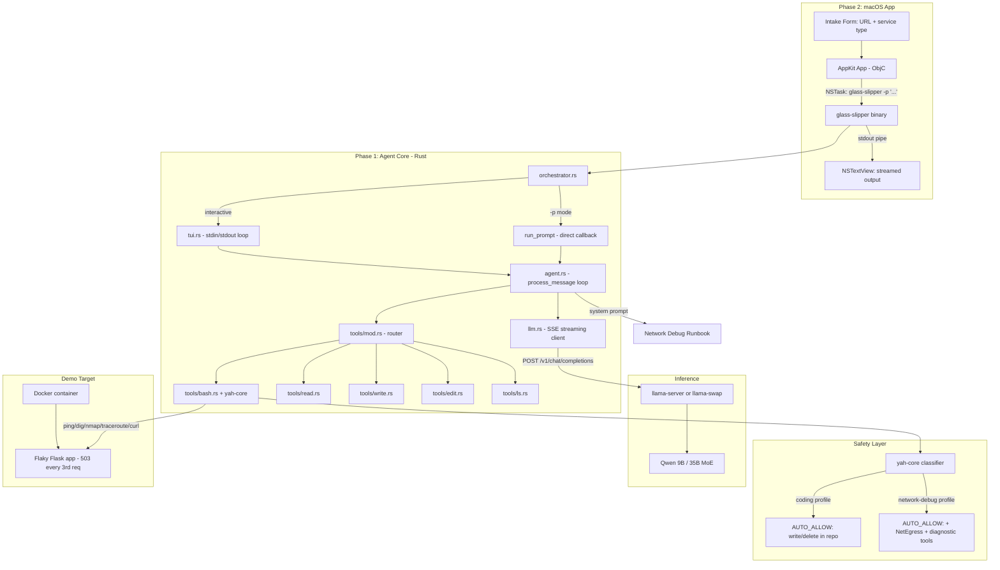

# Cocoa — Native macOS Network Diagnostic Agent Demo

Created by /gauntlette-start on 2026-04-30
Branch: master (feature name: cocoa) | Repo: glass-slipper
Design doc: /Users/robertkarl/.gauntlette/designs/glass-slipper/cocoa-design-20260430-122556.md

## Problem Statement

AI coding agents pointed at local models (aider, opencode, Claude Code + Ollama) fail because they treat Qwen 9B like it's Claude — open-ended, expected to handle ambiguity. Hallucinations come immediately. The thesis: constrain the problem to a specific diagnostic workflow, give the model a step-by-step runbook as a system prompt, and a 9B model can autonomously execute network debugging tasks (ping, dig, nmap, traceroute) and arrive at valid conclusions.

This demo proves or disproves that thesis, wrapped in a native macOS app, for a YC Summer 2026 application. Recording deadline: ~2026-05-03.

## Vision

Open a native Mac app. Enter a URL. Watch Qwen 9B — running on your MacBook — autonomously run ping, dig, nmap, traceroute, and curl, follow a diagnostic runbook step by step, and tell you what's wrong with your service. No cloud. No API keys. No $200/month inference bill. The model is 9 billion parameters and it works because the problem is constrained, not because the model is large.

The demo proves one thesis: small local models + structured playbooks = reliable autonomous capability. If a 9B model can follow a diagnostic runbook and correctly identify that a Flask service is returning 503s 33% of the time, the "you need GPT-4 for agents" assumption is wrong.

## Planning Mode

BUILDER — This is a 3-day sprint to a YC demo recording. The interview focused on narrowing scope, identifying the riskiest assumption (can Qwen 9B follow a diagnostic runbook?), and sequencing work so the hard part gets validated first.

## Feature Spec

**Phase 1: Agent reliability (days 1-2)**

The user runs `glass-slipper <project-dir> --api-url http://localhost:8787` (or homelab URL) and gives it a network debugging task. The system prompt is a step-by-step diagnostic runbook:

1. Parse the target (URL, IP, hostname)
2. DNS resolution (dig, nslookup)
3. Connectivity (ping, with timeout)
4. Route analysis (traceroute)
5. Port scanning (nmap specific ports, or curl)
6. Service-level check (HTTP status, response headers, response body)
7. Synthesize findings into a diagnosis

The agent follows these steps using the `bash` tool. Each step's output feeds the next. The model does NOT improvise — it follows the runbook. If a step fails, the prompt tells it what to conclude and what to try next.

A Docker container runs a deliberately flaky service (e.g., Flask app that returns 503 every 3rd request, or drops connections after 5 seconds, or has DNS that resolves intermittently). This is the reproducible demo scenario.

**Phase 2: Native macOS app (day 3)**

Implement `-p` mode in the Rust CLI (per TODO-prompt-mode.md): `glass-slipper <project-dir> -p "debug connectivity to http://localhost:5000"` — sends one prompt, streams output to stdout, exits.

Objective-C AppKit app (programmatic, no XIBs):
- Main window with a simple form: URL text field, service type popup (web service, local container, local server, other), "Diagnose" button.
- Output view: NSTextView showing streamed stdout from `glass-slipper -p "..."` launched via NSTask.
- The form assembles a structured prompt from the user's inputs and passes it to glass-slipper.

## Scope

| Item | Decision | Effort | Why |
|------|----------|--------|-----|
| Network-debug system prompt (runbook) | ACCEPTED | M | The core product. Makes Qwen 9B work where generic agents fail. |
| Reproducible failure scenario (Docker) | ACCEPTED | S | Need something to demo against reliably. |
| Prompt iteration with Qwen 9B | ACCEPTED | M | Must validate the thesis before building the app. |
| yah-core configurable safety profiles | ACCEPTED | S | Network-debug playbook needs a "network-read" profile that allows curl/nmap/dig/traceroute/ping. Without this, the agent can't run any diagnostic commands. |
| Orchestrator refactor (DRY) | ACCEPTED | S | Extract shared agent-launch pattern before adding -p mode. Prevents 3 copies of the dispatch loop. |
| `-p` (non-interactive prompt) mode in Rust CLI | ACCEPTED | S | Required for NSTask integration. Plan exists in TODO-prompt-mode.md. |
| AppKit app (ObjC, programmatic) | ACCEPTED | M | Native Mac window for demo. NSTask shells out to glass-slipper. |
| GBNF grammar-constrained decoding | ACCEPTED (stretch) | S | Forces model to emit valid tool-call JSON. Eliminates "explains instead of acts" failure mode. Can defer if prompt alone hits 3/5 success rate. |
| Intake form (URL, service type, go button) | ACCEPTED | S | Minimal structured input. |
| Multiple playbooks (disk, SSL, DNS, etc.) | DEFERRED | L | v2. Demo has one playbook. |
| Playbook-as-data-structure | DEFERRED | M | Hardcode for demo. Abstract later. |
| Styled output (color-coded thinking/tools/results) | DEFERRED | M | Plain text NSTextView is enough for demo. Can polish later. |
| Sidebar with diagnostic step checkmarks | DEFERRED | M | Impressive but not worth the risk in 3 days. |

## Resolved Decisions

| Decision | Why | Rejected |
|----------|-----|----------|
| Two-phase approach: prove agent works first, then wrap in native app | Agent reliability is the existential risk. No point building a pretty shell around a broken agent. | Build both in parallel |
| ObjC + AppKit, programmatic layout | User knows ObjC, dislikes SwiftUI. No XIBs (not agent/merge friendly). | SwiftUI, XIBs |
| NSTask shells out to Rust CLI | Cleanest separation. Glass Slipper and Mac app develop completely in parallel. Defers hard bridging decisions. | uniffi-rs, cbindgen FFI, pure ObjC rewrite |
| Hardcoded network-debug playbook | 3-day sprint. One playbook, done well. | Playbook framework, multiple playbooks |
| Approach A (minimal viable demo) | Most time on the hard part. ObjC app is simple. | Polished native demo (too risky), CLI-only (not impressive enough) |
| Qwen 9B local on MacBook for demo | No network dependency during recording. Proves the harder thesis. 35B is a free upgrade if needed. | 35B via homelab (network dependency is ironic for a network debugging demo) |
| Flaky Flask 503 as primary demo scenario | Easy to understand on camera, satisfying diagnosis, shows multi-step reasoning. DNS misconfig and port-blocked saved as future playbook scenarios. | DNS misconfig (harder to explain in 90s), port-blocked (boring diagnosis) |
| Plain text `-p` output | AppKit app is an NSTextView. No parsing needed. JSON adds complexity for zero demo value. | Structured JSON events (deferred to v2 if needed) |
| yah-core configurable safety profiles (not blanket allow) | yah-core's job is "set reasonable boundaries for the current task so the agent can go ham while keeping me safe." Network-debug mode opts the user into allowing diagnostic network tools. Multiple configurations, not a kill switch. | Add NetEgress to global AUTO_ALLOW (too broad), --allow-network flag (ad-hoc), disable yah-core in -p mode (loses all safety) |
| Refactor orchestrator before adding -p mode | run() and run_remote() are near-identical. Adding run_prompt() as a third copy is unacceptable. Extract shared agent-launch pattern first (~20 min). | Accept duplication (creates 3 copies of same logic) |

## Codebase Health

STATUS: HEALTHY

- Stack: Rust 2021, tokio async runtime, reqwest HTTP, crossterm terminal, serde JSON, yah-core bash safety
- Structure: Single crate, flat src/ layout, 14 source files, ~2.9K lines
- Test coverage: 32 tests (config, tools, llm parsing). No integration tests against live llama-server.
- Documentation: README, CINDY-DEV-GOALS.md, TODO.md, TODO-prompt-mode.md, CHANGELOG.md
- Dependency freshness: Current (crossterm 0.28, reqwest 0.12, tokio 1, serde 1, clap 4)
- Git hygiene: Clean. 10 commits on master. `init` branch has the original implementation.

## Relevant Code

**Agent loop:** `src/agent.rs` — `Agent::process_message()` (lines 73-262). This is the loop that calls llama-server, parses tool calls, executes tools, and iterates. The system prompt that needs to be replaced/augmented is in `src/config.rs:94-112`.

**Tool execution:** `src/tools/mod.rs` (234 lines) — router. `src/tools/bash.rs` (301 lines) — bash tool with yah-core safety, timeout, process group kill. This is the primary tool for the network debugging demo.

**LLM client:** `src/llm.rs` (419 lines) — SSE streaming client, tool call parsing, JSON repair.

**CLI entry:** `src/main.rs` (92 lines) — clap arg parsing. The `-p` flag needs to be added here.

**TUI:** `src/tui.rs` (296 lines) — plain stdout rendering, event loop.

**Orchestrator:** `src/orchestrator.rs` (286 lines) — server lifecycle, agent launch.

**System prompt:** `src/config.rs:94-112` — generic coding prompt. Needs a network-debug variant or replacement.

**yah-core safety:** `src/tools/bash.rs:46-121` — AUTO_ALLOW/AUTO_DENY lists, classify_command(). Needs configurable profiles for network-debug mode.

## Relevant Design History

- `init` design: `/Users/robertkarl/.gauntlette/designs/glass-slipper/init-design-20260422-170500.md` — full v0.1.0 design. Covers agent architecture, tool calling reliability, SSE streaming, context management. All implemented. This design builds on that foundation.
- `-p` mode plan: `TODO-prompt-mode.md` in repo — detailed plan for non-interactive prompt mode. Not yet implemented. Required for Phase 2.

## Open Wounds

- Tool call reliability with Qwen 9B for sysadmin tasks is unproven. The existing agent works for coding tasks but network debugging is untested.
- `config.rs:34` has `sha256: "TODO_FILL_AFTER_DOWNLOAD"` — model checksum not filled in.
- `tools/bash.rs:150` has `// TODO: wire TUI confirmation flow for interactive approval` — yah-core safety confirmation not fully wired. For now, unconfirmable commands are denied. Network-debug profile must bypass this for diagnostic commands.
- `orchestrator.rs:127` has `// TODO: implement proper cancellation of in-flight tool execution`.

## Tech Debt

- 3 TODOs in source (listed above). None block the demo.
- No integration tests against a live llama-server.
- Context management uses rough chars/4 token estimation.
- orchestrator.rs run() and run_remote() are near-duplicates (~100 lines each). Refactor is planned as a prerequisite for -p mode.

## Deferred (future playbooks / features)

| Item | Notes |
|------|-------|
| "My local dev app isn't running" playbook | User selects project dir with docker-compose.yml. Container is stopped. Agent runs `docker ps`, reads compose file, runs `docker compose up -d`, verifies. Simple, satisfying on camera — perfect warmup demo or onboarding scenario. |
| Conflicting DNS results playbook | Different DNS servers (localhost, router, 8.8.8.8) return different answers. Agent queries each with `dig @<server>`, compares, identifies the stale/wrong resolver. Many variants: split-horizon DNS, stale cache, NXDOMAIN from one but valid from another. Real-world Amazon-style transient networking pain. |
| Port blocked by firewall | Agent discovers service is up but port is filtered. `nmap` shows filtered, `curl` hangs. Simpler diagnosis than DNS but still useful. |
| Playbook-as-data-structure / framework | Abstract playbooks into a data structure so users can author their own. v2. |
| Grammar-constrained decoding for tool calls | See Architecture section — GBNF grammar forces model to emit valid tool-call JSON instead of free text. Deferred only as a scope item; the llama.cpp support exists today and should be wired in during implementation if time allows. |
| Xcode-style launch screen with recent projects | Nice for product vision but not needed for 3-day demo. |
| Styled/color-coded output in the native app | Plain text NSTextView is enough for demo. |
| Sidebar with diagnostic step checkmarks | Impressive but not worth the risk in 3 days. |
| User-authored playbooks | Depends on playbook-as-data-structure. |
| Structured JSON output from `-p` mode | Only needed if AppKit app wants richer parsing than plain text. |
| Windows/Linux support | macOS only for demo. |
| brew install distribution | Post-demo. |

## Architecture

### Mermaid: Architecture



### Mermaid: Data Flow — Agent Diagnostic Loop

```mermaid
sequenceDiagram
    participant U as User / NSTask
    participant A as Agent
    participant Y as yah-core
    participant L as LLM (Qwen 9B)
    participant B as bash tool
    participant T as Target Service

    U->>A: "debug connectivity to localhost:5000"
    A->>L: system: runbook + user: prompt
    L->>A: tool_call: bash("dig localhost")
    A->>Y: classify("dig localhost", network-debug profile)
    Y-->>A: Allow
    A->>B: execute("dig localhost")
    B->>T: DNS lookup
    T-->>B: result
    B-->>A: tool result
    A->>L: messages + tool result
    L->>A: tool_call: bash("ping -c 3 localhost")
    A->>Y: classify("ping ...", network-debug profile)
    Y-->>A: Allow
    A->>B: execute
    B-->>A: result
    A->>L: messages + tool result
    L->>A: tool_call: bash("curl -v http://localhost:5000")
    A->>Y: classify("curl ...", network-debug profile)
    Y-->>A: Allow
    A->>B: execute
    B->>T: HTTP request
    T-->>B: 503
    B-->>A: result
    A->>L: messages + tool result
    L->>A: tool_call: bash("for i in {1..10}; do curl ...")
    A->>B: execute loop
    B->>T: 10 requests
    T-->>B: mix of 200/503
    B-->>A: result
    A->>L: messages + tool result
    L-->>A: text: "Diagnosis: 503 ~33% of requests..."
    A-->>U: streamed diagnosis
```

### ASCII: Architecture

```
┌─────────────────────────────────────────────────────┐
│  macOS AppKit App (ObjC, programmatic)              │
│  ┌───────────────────┐  ┌─────────────────────────┐ │
│  │ URL: [_________]  │  │ NSTextView (stdout)     │ │
│  │ Type: [Web svc ▼] │  │ > dig localhost         │ │
│  │ [Diagnose]        │  │ > ping -c 3 localhost   │ │
│  └───────────────────┘  │ > curl -v :5000         │ │
│         │ NSTask        │ Diagnosis: 503 every    │ │
│         ▼               │ 3rd request...          │ │
│  glass-slipper -p "..."    └─────────────────────────┘ │
│  stdout piped to NSTextView                         │
├─────────────────────────────────────────────────────┤
│  glass-slipper (Rust)                                  │
│                                                     │
│  main.rs ─► orchestrator.rs                         │
│              ├─ -p mode: run_prompt() ──► agent.rs  │
│              └─ interactive: tui.rs ──► agent.rs    │
│                                                     │
│  agent.rs: system_prompt + LLM loop + tool dispatch │
│  llm.rs: SSE streaming, tool call parse, JSON repair│
│  tools/bash.rs: yah-core classify ► bash -c ► output│
│                                                     │
│  yah-core profiles:                                 │
│    coding:       write/delete in repo allowed        │
│    network-debug: + NetEgress, diagnostic tools      │
├─────────────────────────────────────────────────────┤
│  llama-server / llama-swap                          │
│  Qwen 9B (local) or 35B MoE (homelab)              │
├─────────────────────────────────────────────────────┤
│  Docker: Flask app, 503 every 3rd request           │
└─────────────────────────────────────────────────────┘
```

### Failure Matrix

```
Failure                        │ Severity │ Likelihood │ Mitigated?
───────────────────────────────┼──────────┼────────────┼──────────────────────────────
yah-core blocks diagnostic cmd │ CRITICAL │ CERTAIN    │ YES — network-debug profile
Model ignores runbook          │ HIGH     │ MEDIUM     │ Prompt + GBNF grammar constrains to tool calls
Model text instead of tools    │ MEDIUM   │ LOW-MED    │ GBNF grammar: model cannot emit free text outside thinking
llama-server OOM               │ HIGH     │ LOW        │ RAM check exists in orchestrator
NSTask hangs (stdin read)      │ HIGH     │ LOW        │ -p mode skips TUI, never reads stdin
Flask container not running    │ LOW      │ MEDIUM     │ Agent diagnoses "connection refused" correctly
Demo scenario too easy for 9B  │ LOW      │ LOW        │ Flask 503 scenario validated as non-trivial
```

### Test Matrix

```
Component               │ Happy Path │ Error Path │ Edge Cases │ Integration
────────────────────────┼────────────┼────────────┼────────────┼────────────
Network debug prompt     │     □      │     □      │     □      │     □
  Qwen 9B follows steps  │            │            │            │
yah-core network profile │     □      │     □      │     □      │     □
  allows curl/nmap/dig   │            │            │            │
Orchestrator refactor    │     □      │     □      │     □      │     □
  existing tests pass    │            │            │            │
-p mode                  │     □      │     □      │     □      │     □
  streams output, exits  │            │            │            │
Docker demo target       │     □      │     □      │     □      │     □
  Flask returns 503/3    │            │            │            │
AppKit app               │     □      │     □      │     □      │     □
  NSTask launch + stream │            │            │            │
```

## Implementation Approaches

### Approach A: Minimal viable demo (CHOSEN)
2 days agent reliability + prompt engineering. 1 day bare-bones AppKit app. NSTask shells out to CLI.
- Effort: M | Risk: Low | Completeness: 7/10
- Reuses: entire existing Glass Slipper agent, llama-server integration, tool infrastructure

### Approach B: Polished native demo
Same + richer AppKit UI (sidebar, checkmarks, styled output).
- Effort: L | Risk: Medium | Completeness: 9/10
- Reuses: same as A

### Recommended
Approach A. Agent reliability is the existential risk. Spend the time there.

## Implementation

Files to modify:
- `src/config.rs` — add network-debug system prompt; add safety profile enum
- `src/main.rs` — add `-p` flag; pass safety profile based on prompt content or flag
- `src/tui.rs` — extract event printing for `-p` mode (per TODO-prompt-mode.md)
- `src/orchestrator.rs` — refactor to extract shared agent-launch pattern; add run_prompt() branch
- `src/tools/bash.rs` — accept safety profile; use profile-specific AUTO_ALLOW list
- `src/tools/mod.rs` — pass safety profile through to bash tool
- `src/agent.rs` — accept and pass safety profile to tool executor
- `src/llm.rs` — add optional `grammar` field to chat_completion request body for GBNF support

Files to create:
- `demo/Dockerfile` — flaky Flask service
- `demo/app.py` — Flask app with deliberate failures
- `demo/docker-compose.yml` — easy demo setup
- `src/grammar.gbnf` (or inline in config.rs) — GBNF grammar constraining model output to valid tool-call JSON
- `cocoa/` — Objective-C AppKit app directory (Xcode project or Makefile-driven)

Files to delete: none

Implementation order:
0. **POC gate: validate Qwen 9B** — Before writing any implementation code, run a 30-minute manual test: give Qwen 9B the diagnostic runbook prompt in the existing interactive CLI against a real localhost service. Measure pass rate. If <2/5 success, pivot to 35B or simplify the diagnostic task before committing to days 1-2 of implementation.
1. **Network-debug system prompt** — write and test the diagnostic runbook prompt in `src/config.rs`
2. **Docker demo target** — flaky Flask service in `demo/`
3. **yah-core configurable safety profiles** — add profile enum to `bash.rs`, plumb through `tools/mod.rs` → `agent.rs` → `orchestrator.rs`. Network-debug profile allows NetEgress + diagnostic tools. Default coding profile unchanged.
4. **Test agent against demo target** — iterate on prompt until Qwen 9B follows the steps via interactive mode. Verify yah-core network-debug profile allows diagnostic commands.
5. **GBNF grammar-constrained decoding** — write GBNF grammar for tool-call JSON. Add `grammar` field to `llm.rs` chat_completion request. Test: model should be unable to produce free text when it should be calling tools. If time is tight, this can be deferred — prompt engineering alone may suffice for 3/5 success rate.
6. **Orchestrator refactor** — extract shared agent-launch pattern from run()/run_remote(). Both call the shared function.
7. **Implement `-p` mode** — per TODO-prompt-mode.md plan, on top of the refactored orchestrator. run_prompt() calls agent directly with print callback, no channels.
8. **Build AppKit app** — ObjC, NSTask, NSTextView. Last because it's easiest and lowest-risk.

Checkpoints:
0. POC gate passes: Qwen 9B follows at least 2/5 diagnostic runs in interactive CLI before any implementation begins
1. Qwen 9B follows the diagnostic runbook and correctly identifies the flaky service problem (via interactive CLI, with network-debug profile)
2. `-p` mode works: `glass-slipper . -p "debug connectivity to localhost:5000"` streams output and exits
3. AppKit app launches glass-slipper, shows live output, and the demo is recordable

Critical reliability note: Qwen 9B's canonical failure mode is emitting free text instead of tool calls — it "explains" what it would do instead of doing it. Two mitigations, use both:

1. **Prompt engineering:** The runbook must say "You MUST use the bash tool to execute each step. Do not explain what you would do — execute the commands."
2. **Grammar-constrained decoding (GBNF):** llama.cpp supports GBNF grammars via the `grammar` field in the `/v1/chat/completions` API. A GBNF grammar can force the model to emit only valid tool-call JSON (outside of `<think>` blocks). Invalid tokens get their logits set to -inf — the model literally cannot produce free text when it should be calling tools. This is "rug-pull decoding": the model thinks it's choosing to call a tool, but actually it had no choice. This is a natural fit for a constrained-playbook agent — we already know the output must be a tool call at every step except the final synthesis.

Implementation: write a GBNF grammar that allows either `{"name": "bash", "args": {"command": "..."}}` or free text (for the final diagnosis). Pass it via the `grammar` field in `llm.rs` chat_completion request body. llama-server handles enforcement at the token level.

## Priorities

1. **System prompt quality** — the diagnostic runbook that constrains Qwen 9B
2. **yah-core network-debug profile** — without it, diagnostic commands are denied
3. **Agent reliability against the demo scenario** — must work 3/5 times minimum
4. **GBNF grammar-constrained decoding** — eliminates "text instead of tools" failure mode. Stretch goal if prompt alone doesn't hit 3/5.
5. **Orchestrator refactor** — prerequisite for clean -p mode
6. **`-p` mode** — required for NSTask integration
7. **AppKit app** — last, because it's the easiest and lowest-risk piece

## Gauntlette Review Report

| Review | Trigger | Runs | Status | Findings |
|--------|---------|------|--------|----------|
| Planning Kickoff | `/gauntlette-start` | 1 | DONE | Builder mode. Two-phase approach: prove agent works (days 1-2), then wrap in ObjC native app (day 3). Network-debug playbook only. System prompt is the product. |
| CEO Review | `/gauntlette-ceo-review` | 1 | CLEAR | HOLD scope. Resolved model (9B local), demo scenario (flaky 503), output format (plain text). No scope changes needed. Vision sharpened. |
| Design Review | `/gauntlette-design-review` | 0 | — | — |
| Engineering Review | `/gauntlette-eng-review` | 1 | CLEAR | Found showstopper: yah-core blocks all diagnostic commands. Resolved: configurable safety profiles (network-debug profile allows NetEgress). Orchestrator refactor before -p mode. Implementation order updated. |
| Fresh Eyes | `/gauntlette-fresh-eyes` | 1 | CLEAR | 9 findings: 3 critical, 3 important, 3 minor. User accepted 1 (POC gate for Qwen 9B), skipped 2 (GBNF timing, -p mode order — "opus can figure it out"). |
| Implementation | `/gauntlette-implement` | 1 | DONE | Phase 1 agent core: SafetyProfile enum + network-debug runbook prompt (config.rs), configurable yah-core profiles plumbed through bash→tools→agent→orchestrator, orchestrator refactored (DRY), -p prompt mode + --playbook flag, Docker flaky Flask demo. 5 commits, 34 tests pass (2 new). Phase 2 AppKit app not yet started. |
| Code Review | `/gauntlette-code-review` | 1 | PASS | 15 findings (2 adversarial subagents). 3 critical, 5 important, 7 minor. Fixed: nmap missing from yah-core NET_EGRESS_COMMANDS (security bypass), prompt falsely claimed "ONE tool: bash" (text fix), agent loop infinite in -p mode (added MAX_AGENT_ITERATIONS=25), traceroute timeout advice wrong (use timeout(1)). Docker port changed to 14094. User skipped 6 lower-severity findings (blanket NetEgress, try_send drops, exit code, pub fields, remote ctx_size, NO_COLOR perf) as acceptable for demo sprint. Unicode→ASCII indicator change confirmed intentional by user. |
| QA | `/gauntlette-quality-check` | 0 | — | — |
| Human Review | `/gauntlette-human-review` | 0 | — | — |
| Ship It | `/gauntlette-ship-it` | 1 | DONE | Squash merged cocoa→master. v0.1.1.0. 34 tests pass. 2026-04-30. |

**VERDICT:** SHIPPED v0.1.1.0 — Phase 1 agent core shipped. Phase 2 (AppKit app) and prompt iteration against live Qwen 9B remain as future work.
