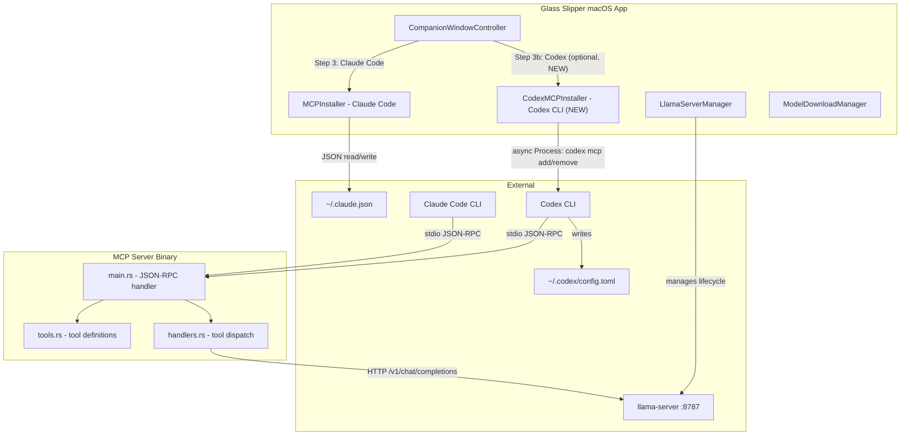
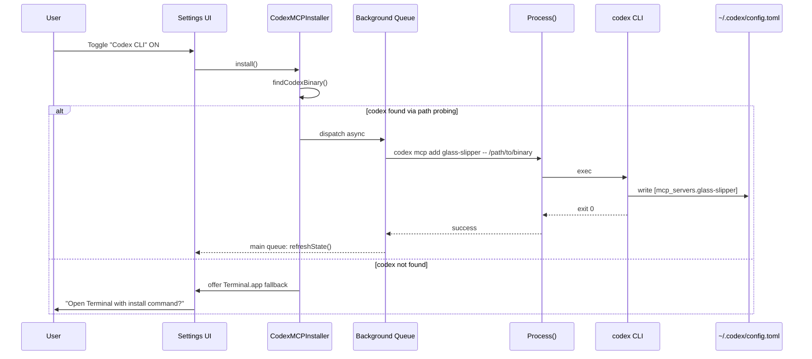
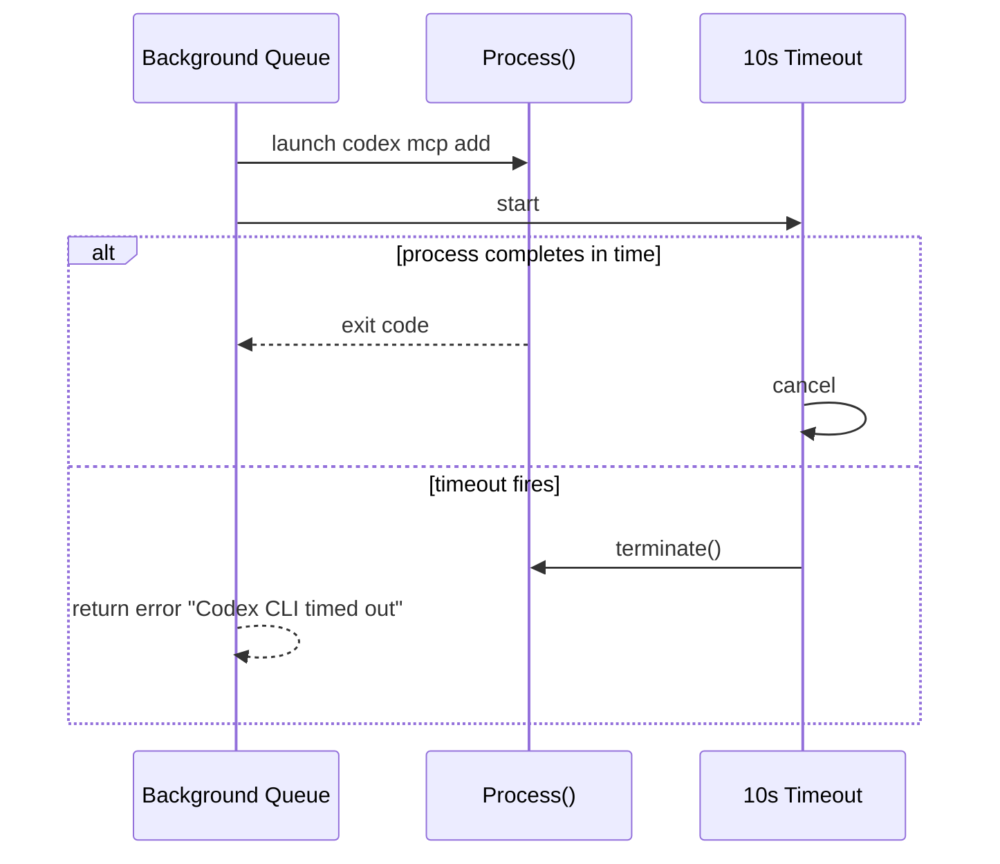

# Codex CLI MCP Support for Glass Slipper

Created by /gauntlette-start on 2026-05-14
Branch: master | Repo: glass-slipper
Design doc: /Users/robertkarl/.gauntlette/designs/glass-slipper/codex-mcp-support-design-20260514-091404.md

## Problem Statement

Two gaps block Glass Slipper's MCP server from working well with Codex CLI:

1. **Installation gap:** MCPInstaller.swift only handles Claude Code. Codex users must manually run `codex mcp add`.
2. **Instruction gap:** Claude Code surfaces the MCP server's `instructions` field as a system reminder, telling the model to prefer MCP tools over direct file reads. Codex does not surface these instructions effectively. In testing (2026-05-14), Codex read all files itself before using MCP tools as an afterthought, defeating the token-saving purpose.

## Vision

Glass Slipper's MCP server works with Codex CLI, not just Claude Code. Two concrete problems:

1. **Codex ignores MCP tools.** In testing (2026-05-14), Codex read all files itself before touching MCP tools. The tool descriptions explain what the tools do but don't tell the model to prefer them. Fix: make descriptions directive ("PREFER this tool over reading files directly when you need to understand or summarize content").
2. **No one-click install for Codex.** MCPInstaller.swift only handles Claude Code. Codex users must manually run `codex mcp add`. Fix: add a Codex toggle in the settings UI that shells out to the official CLI.

The tool description fix is the real value. The installer is a convenience. Both ship together.

## Planning Mode

PRODUCT -- this is a shipping feature for Glass Slipper users who also use Codex CLI. The interview focused on market coverage, installer UX, the installation mechanism, and the instruction gap discovered during smoke testing.

## Feature Spec

Two changes:

**1. Stronger tool descriptions (src/mcp/tools.rs):**
Current tool descriptions explain what tools do but don't tell the model to prefer them. Update descriptions to be directive with a carveout: "PREFER this tool over reading files directly when you need to understand or summarize content. Only read files directly when you need raw content for editing." This is harness-agnostic and benefits both Claude Code and Codex.

**2. Codex installer (CodexMCPInstaller or extension to MCPInstaller):**
The Glass Slipper settings UI gains a Codex CLI row alongside the existing Claude Code toggle. When the user enables Codex:
- The app runs `codex mcp add glass-slipper -- /path/to/glass-slipper-mcp` via Process() **on a background queue with a 5-10 second timeout**
- The toggle reflects the current state (installed or not) via `codex mcp get glass-slipper` exit code
- Disabling runs `codex mcp remove glass-slipper`
- If `codex` isn't found via probe (common paths), the toggle is disabled with an explanation
- **Fallback:** If codex can't be found, offer to open Terminal.app with the `codex mcp add` command pre-filled
- The Codex row is **optional, not gating** -- the dashboard appears once Model + Server + Claude Code are configured

## Scope

| Item | Decision | Effort | Why |
|------|----------|--------|-----|
| Stronger tool descriptions in tools.rs | ACCEPTED | S | Harness-agnostic fix for instruction gap |
| Codex install via `codex mcp add` | ACCEPTED | S | Core feature, uses official CLI |
| Codex uninstall via `codex mcp remove` | ACCEPTED | S | Clean removal needed |
| Codex detection (probe common paths) | ACCEPTED | S | Must know if Codex is available; `which` alone fails from Dock-launched apps |
| Codex row in settings UI (optional, not gating) | ACCEPTED | S | User-facing control |
| isInstalled via `codex mcp get` exit code | ACCEPTED | S | Toggle state needs to reflect reality (confirmed: command exists) |
| Async Process + timeout for all codex CLI calls | ACCEPTED | S | Prevent UI freeze |
| Terminal.app fallback when codex not found | ACCEPTED | S | Covers users with non-standard installs |
| AGENTS.md with MCP usage instructions | DEFERRED (fallback) | S | Per-repo, not global; try tool descriptions first. If descriptions don't change Codex behavior (test: Codex uses MCP tools on first attempt in 3/3 test prompts), promote to ACCEPTED. |
| ~/.codex/instructions.md with global MCP guidance | DEFERRED (fallback) | S | Not confirmed Codex supports this; try tool descriptions first. Promote if AGENTS.md also insufficient. |
| Post-install verification via `codex mcp get` | ACCEPTED | S | After install, verify binary path in output matches intended path. Prevents silent bad config. |
| Gemini CLI / Cursor support | DEFERRED | M | Same pattern, do after Codex ships |
| TOML fallback if codex not on PATH | DEFERRED | M | Over-engineering for v1 |

## Resolved Decisions

| Decision | Why | Rejected |
|----------|-----|----------|
| Shell out to `codex` CLI for install | Official interface, correct by construction, no TOML parsing | Direct TOML editing (fragile, no Swift TOML lib) |
| Strengthen tool descriptions, not add AGENTS.md | Harness-agnostic, no per-repo pollution, simplest first step. Descriptions are a hypothesis -- if Codex still ignores MCP tools after the change (test: 3/3 prompts), promote AGENTS.md from DEFERRED | AGENTS.md (per-repo), global instructions (unconfirmed Codex support) |
| Cached state + async verify for Codex isInstalled | refreshState() reads cached boolean synchronously for instant UI. Fires async `codex mcp get` in background, dispatches back to main queue to update toggle if real state differs. Best of both: no UI freeze, eventually correct. | Fully async refreshState (large refactor), sync-only cache (misses external changes) |
| Post-install verify with `codex mcp get` | After `codex mcp add` exits 0, run `codex mcp get glass-slipper` and verify binary path matches. Prevents silent bad config. | Trust exit code alone |
| Document CLI format + pin Codex version | Run `codex mcp add --help`, document exact arg format, pin minimum Codex CLI version | Assume format is stable |
| Separate toggles per harness | Clear, explicit, scales to future harnesses | Single "install all" button |
| Probe common paths for codex detection | macOS GUI apps get minimal PATH; `which` alone fails for Dock-launched apps | `which codex` only (fragile), reading shell profile (side effects) |
| Async Process with timeout | Sync Process blocks UI thread; codex CLI could hang | Sync Process (UI freeze risk) |
| Directive descriptions with carveout | Need to change model behavior without blocking legitimate direct reads for editing | Maximally aggressive (blocks real reads), gentle nudge (no behavior change) |
| Codex row is optional, not gating | Users may only use Claude Code; requiring Codex would block their dashboard | Gating on Codex (breaks non-Codex users) |
| isInstalled via `codex mcp get` exit code | Confirmed working: returns structured output when installed, non-zero when not | `codex mcp list` + parse (works but string parsing is fragile) |
| Terminal.app fallback when codex not found | Covers non-standard install locations; user's terminal has real PATH | Only probe paths (misses unusual installs) |
| Use Process.arguments array (not shell string) | Binary path contains space ("Glass Slipper.app"); shell string would split incorrectly | Shell string construction |

## Codebase Health

STATUS: HEALTHY

- Stack: Rust (MCP server), Swift (macOS app), Python/Flask (website)
- Structure: Clean separation between MCP server, app, and website
- Test coverage: MCP server has unit tests in tools.rs. Website has tests.
- Documentation: README covers website deploy; MCP setup in installer code
- Dependency freshness: Current
- Git hygiene: Clean, linear history

## Relevant Code

- `/Users/robertkarl/Code/cinderella/src/mcp/tools.rs:9-161` -- tool definitions with descriptions (MODIFY: strengthen descriptions with carveout)
- `/Users/robertkarl/Code/cinderella/glass-slipper/MCPInstaller.swift` -- current Claude Code installer (MODIFY: extract shared mcpBinaryPath)
- `/Users/robertkarl/Code/cinderella/glass-slipper/CompanionWindowController.swift` -- setup UI with 3-step flow (MODIFY: add optional Codex row)
- `/Users/robertkarl/Code/cinderella/src/mcp/main.rs` -- MCP server entry point (no changes needed)
- `/Users/robertkarl/Code/cinderella/src/mcp/handlers.rs` -- tool handlers (no changes needed)
- `~/.codex/config.toml:84-85` -- where Codex MCP config lives after `codex mcp add`

## Relevant Design History

- `/Users/robertkarl/.gauntlette/designs/glass-slipper/production-server-design-20260513-113103.md` -- prior design for server migration. Not related to MCP.

## Known Limitations

- **App relocation breaks MCP configs.** `mcpBinaryPath` is `Bundle.main.bundlePath + "/Contents/MacOS/glass-slipper-mcp"`. This absolute path gets baked into both `~/.claude.json` and `~/.codex/config.toml`. If the user moves the app, both configs point to a nonexistent binary. Pre-existing issue (affects Claude Code installer too). Fix in a future pass.

## Open Wounds

None relevant to this feature.

## Tech Debt

None relevant to this feature.

## Out of Scope

- Gemini CLI / Cursor / Windsurf support (same pattern, do later)
- TOML fallback if codex isn't installed
- AGENTS.md per-repo MCP instructions (try tool descriptions first)
- Global Codex instructions file (unconfirmed support)
- MCP protocol changes (binary works as-is)

## Architecture

### Mermaid: Architecture



### Mermaid: Data Flow (Install)



### Mermaid: Data Flow (Timeout)



### ASCII: Architecture

```
CompanionWindowController
  |
  +-- SetupRow "1. Model"       --> ModelDownloadManager
  +-- SetupRow "2. Server"      --> LlamaServerManager
  +-- SetupRow "3. Claude Code" --> MCPInstaller.install() --> read/write ~/.claude.json
  |
  +-- SetupRow "Codex CLI" (NEW, optional, not gating allDone)
  |     |
  |     +-- CodexMCPInstaller.findCodexBinary()
  |     |     probe: /usr/local/bin/codex, ~/.local/bin/codex,
  |     |            /opt/homebrew/bin/codex, $(which codex)
  |     |
  |     +-- CodexMCPInstaller.install()  -- async Process + 10s timeout
  |     |     args: ["codex", "mcp", "add", "glass-slipper", "--", mcpBinaryPath]
  |     |     NOTE: use Process.arguments array, NOT shell string (space in path)
  |     |
  |     +-- CodexMCPInstaller.isInstalled -- async codex mcp get glass-slipper, check exit code
  |     |
  |     +-- Fallback: open Terminal.app with pre-filled command if codex not found
  |
  allDone = modelOK && serverOK && mcpOK   // Codex NOT included

MCP Binary (tools.rs descriptions updated):
  tools/list --> tool_definitions() --> directive descriptions with carveout
  initialize --> instructions field (unchanged)
```

### Failure Matrix

```
Scenario                          | What happens              | User sees              | Plan handles?
----------------------------------+---------------------------+------------------------+--------------
codex not on PATH or common paths | findCodexBinary() fails   | "Open Terminal?" offer  | YES
codex mcp add fails (exit != 0)  | Process returns error     | Error alert             | YES
codex mcp add hangs              | 10s timeout fires         | "Codex CLI timed out"   | YES (async+timeout)
codex mcp remove on uninstalled  | codex returns error       | Error alert             | YES
Binary path has spaces           | Process.arguments handles | Works correctly          | YES (array args)
codex config.toml locked/corrupt | codex mcp add fails       | Error alert             | YES (codex handles)
Codex version changes CLI syntax | codex mcp add fails       | Error alert             | Partial
codex mcp get: not installed     | Non-zero exit code        | Shows as uninstalled    | YES
User launches from Dock          | Minimal PATH              | Probe finds codex       | YES (path probing)
```

### Test Matrix

```
Component                  | Happy Path | Error Path | Edge Cases   | Integration
---------------------------+------------+------------+--------------+------------
Tool description changes   |     [ ]    |     N/A    | [ ] carveout | [ ] Codex e2e
CodexMCPInstaller.install  |     [ ]    |     [ ]    | [ ] timeout  | [ ]
                           |            |            | [ ] space path|
CodexMCPInstaller.uninstall|     [ ]    |     [ ]    |     [ ]      | [ ]
CodexMCPInstaller.isInstalled| [ ]      |     [ ]    |     [ ]      | N/A
findCodexBinary()          |     [ ]    |     [ ]    | [ ] Dock PATH| N/A
Terminal.app fallback      |     [ ]    |     N/A    |     N/A      | [ ]
Settings UI (Codex row)    |     [ ]    |     [ ]    | [ ] optional | [ ]
```

## Implementation Approaches

### Approach A: Shell out to `codex mcp add/remove` + stronger tool descriptions
Update tool descriptions in tools.rs. Run async Process() in Swift for Codex install/uninstall. Detect codex via path probing. Timeout at 10s.

- Effort: S
- Risk: Low
- Completeness: 8/10
- Reuses: MCPInstaller.swift structure, existing UI toggle pattern

### Approach B: Write TOML directly + stronger tool descriptions
Update tool descriptions. Parse ~/.codex/config.toml in Swift.

- Effort: M
- Risk: Medium
- Completeness: 6/10
- Reuses: Claude Code installer pattern (but TOML harder than JSON)

### Recommended
Approach A. Official interface, minimal code, no parsing risk. Tool description changes benefit all harnesses.

## Implementation

Files to modify:
- `/Users/robertkarl/Code/cinderella/src/mcp/tools.rs` -- strengthen tool descriptions (directive with carveout)
- `/Users/robertkarl/Code/cinderella/glass-slipper/MCPInstaller.swift` -- extract shared `mcpBinaryPath` to avoid DRY violation
- `/Users/robertkarl/Code/cinderella/glass-slipper/CodexMCPInstaller.swift` -- NEW file: Codex detection, async install/uninstall, isInstalled, Terminal fallback
- `/Users/robertkarl/Code/cinderella/glass-slipper/CompanionWindowController.swift` -- add optional Codex row, wire up handler

Files NOT to modify:
- `src/mcp/main.rs` -- instructions field stays as-is
- `src/mcp/handlers.rs` -- no handler changes needed
- `src/mcp/prompts.rs` -- no prompt changes needed

Implementation order:
1. Strengthen tool descriptions in tools.rs (directive with carveout for raw reads)
2. Run existing MCP tests to verify descriptions still pass
3. Extract `mcpBinaryPath` from MCPInstaller to shared location (or have CodexMCPInstaller reference it)
4. Run `codex mcp add --help` and document exact argument format. Pin minimum Codex CLI version.
5. Create CodexMCPInstaller.swift with:
   - `findCodexBinary()` -- probe /usr/local/bin/codex, ~/.local/bin/codex, /opt/homebrew/bin/codex, then fall back to `which codex`
   - `install()` -- async Process with 10s timeout, using Process.arguments array (not shell string). After exit 0, verify with `codex mcp get glass-slipper` that binary path matches.
   - `uninstall()` -- async Process with timeout
   - `isInstalled` -- cached boolean for synchronous UI reads. On refreshState(), fire async `codex mcp get glass-slipper` in background, dispatch back to main queue to update toggle if real state differs.
   - `openTerminalFallback()` -- open Terminal.app with `codex mcp add glass-slipper -- <path>` pre-filled
6. Add Codex row to CompanionWindowController setup UI (optional, not gating allDone)
7. Add unit test: Process.arguments with space-containing path
8. Build and test: install from app, open Codex, ask it to summarize files
9. Verify Codex uses MCP tools FIRST (not as afterthought). Test criteria: Codex uses MCP tools on first attempt in 3/3 test prompts. If it fails, promote AGENTS.md from DEFERRED to ACCEPTED.

Checkpoints:
1. After step 2: tool description changes pass tests, rebuild MCP binary
2. After step 4: `codex mcp add --help` output documented, arg format confirmed
3. After step 6: Codex install/uninstall works from the app (both direct and Terminal fallback). Post-install verify confirms correct binary path.
4. After step 9: end-to-end verified -- Codex prefers MCP tools (3/3 test prompts). If not, escalate AGENTS.md.

### Implementation Results (2026-05-15)

**Commits (branch: codex-mcp-support):**
- `74658d9` Strengthen MCP tool descriptions with directive PREFER language
- `edfcdf0` Add CodexMCPInstaller for Codex CLI MCP configuration
- `b5a17cf` Add optional Codex CLI row to setup UI
- `7f8fe53` Add CodexMCPInstaller tests and wire up Xcode project

**Files modified:**
- `src/mcp/tools.rs` -- 7 tool descriptions updated with "PREFER this tool over..." + carveout
- `glass-slipper/CompanionWindowController.swift` -- Codex row added, refreshState updated, handleCodexInstall handler added
- `glass-slipper/GlassSlipper.xcodeproj/project.pbxproj` -- new files wired into targets

**Files created:**
- `glass-slipper/CodexMCPInstaller.swift` -- findCodexBinary, install, uninstall, refreshState, openTerminalFallback, runProcessSync
- `glass-slipper/GlassSlipperTests/CodexMCPInstallerTests.swift` -- 5 tests covering path probing, space-safe args, cached state, mcpBinaryPath

**Test results:** 21/21 pass (6 Rust MCP tests + 15 Swift tests including 5 new)

**Deviations from plan:** None. All planned items implemented as specified.

**Codex CLI format confirmed:** `codex mcp add <NAME> -- <COMMAND>`, `codex mcp get <NAME>`, `codex mcp remove <NAME>`

**Remaining:** Manual e2e testing (step 9) -- verify Codex uses MCP tools on first attempt in 3/3 test prompts.

Code details:

**Tool description pattern (tools.rs):**
```rust
// Example for local_summarize:
"description": "Run a shell command and return a concise summary of its output. \
PREFER this tool over reading command output directly -- it keeps verbose output \
out of your context window. Only read command output directly when you need the \
raw text for editing or quoting verbatim."
```

**Async Process pattern (CodexMCPInstaller.swift):**
```swift
static func install(completion: @escaping (String?) -> Void) {
    DispatchQueue.global().async {
        let proc = Process()
        proc.executableURL = URL(fileURLWithPath: codexPath)
        proc.arguments = ["mcp", "add", "glass-slipper", "--", MCPInstaller.mcpBinaryPath]
        // ... launch, wait with timeout, terminate if exceeded
        DispatchQueue.main.async { completion(errorOrNil) }
    }
}
```

**Path probing (CodexMCPInstaller.swift):**
```swift
static func findCodexBinary() -> String? {
    let candidates = [
        "/usr/local/bin/codex",
        NSHomeDirectory() + "/.local/bin/codex",
        "/opt/homebrew/bin/codex",
    ]
    for path in candidates {
        if FileManager.default.isExecutableFile(atPath: path) { return path }
    }
    // Last resort: which codex (works if launched from terminal)
    // ... run Process("which", "codex"), return trimmed output or nil
}
```

## Priorities

1. Stronger tool descriptions (fixes the instruction gap for all harnesses)
2. Install/uninstall via `codex mcp add/remove` works from the app (async, with timeout)
3. UI row reflects correct state
4. Graceful handling when codex isn't installed (Terminal.app fallback)

## Gauntlette Review Report

| Review | Trigger | Runs | Status | Findings |
|--------|---------|------|--------|----------|
| Planning Kickoff | `/gauntlette-start` | 1 | DONE | MCP binary works with Codex as-is. Two gaps: installer + instruction surfacing. Tool descriptions need strengthening. |
| CEO Review | `/gauntlette-ceo-review` | 1 | CLEAR | HOLD scope. Tool descriptions are the real fix; installer is convenience. Ship together per founder decision. |
| Design Review | `/gauntlette-design-review` | 0 | -- | -- |
| Engineering Review | `/gauntlette-eng-review` | 1 | CLEAR | 6 issues found, all resolved. Async Process+timeout, PATH probing, space-safe arguments, directive descriptions with carveout, optional Codex row, Terminal.app fallback. |
| Fresh Eyes | `/gauntlette-fresh-eyes` | 1 | CLEAR | 8 findings (1 critical, 4 important, 3 minor). User accepted 4: fallback plan for tool descriptions, cached+async state for isInstalled, post-install verify, document CLI format. Documented app relocation limitation. Skipped 3 minor items. |
| Implementation | `/gauntlette-implement` | 1 | DONE | 4 commits: tool descriptions, CodexMCPInstaller, UI row, tests. 21/21 tests pass. No deviations from plan. |
| Code Review | `/gauntlette-code-review` | 0 | -- | -- |
| QA | `/gauntlette-quality-check` | 0 | -- | -- |
| Human Review | `/gauntlette-human-review` | 0 | -- | -- |
| Ship It | `/gauntlette-ship-it` | 0 | -- | -- |

**VERDICT:** IMPLEMENTING -- Implementation complete, ready for code review

## CEO Review Notes

**SCOPE RECOMMENDATION: HOLD**

Scope is right. The tool description fix is the painkiller (Codex ignoring MCP tools defeats the product). The installer toggle is a vitamin (users can run `codex mcp add` themselves). Founder chose to ship both together -- low risk, small scope, gets it done.

Challenge summary:
- **Real user, real problem.** Observed in testing on 2026-05-14.
- **Not building this = Codex users burn tokens.** The instruction gap makes MCP decorative for non-Claude-Code harnesses.
- **Low maintenance.** Tool descriptions are text. Installer shells out to Codex's public CLI.
- **Will matter in 6 months** if Glass Slipper supports multiple harnesses (likely).
- **DEFERRED items correctly deferred.** AGENTS.md and global instructions are "try the simple thing first" punts. Revisit only if tool descriptions don't close the gap.

## Engineering Review Notes

**6 issues raised and resolved:**

1. **Process() blocks UI (CRITICAL):** Sync Process() in button handler freezes the app. Resolution: async dispatch to background queue with 10s timeout. Kill process on timeout.

2. **Binary path has spaces:** "Glass Slipper.app" contains a space. Resolution: use `Process.arguments` array (not shell string). Add test with space-containing path.

3. **`which codex` fails from Dock:** macOS GUI apps get minimal PATH. Resolution: probe common paths (/usr/local/bin, ~/.local/bin, /opt/homebrew/bin) before falling back to `which`.

4. **Terminal.app fallback:** If codex can't be found at all, offer to open Terminal.app with the install command pre-filled. User's terminal has the real PATH.

5. **Tool descriptions -- directive with carveout:** Descriptions should say "PREFER this tool for understanding/summarizing" but not ban direct reads. Models still need raw content for editing.

6. **Codex row is optional, not gating:** allDone stays `modelOK && serverOK && mcpOK`. Users who don't use Codex can still reach the dashboard.

**Additional notes:**
- Extract `mcpBinaryPath` from MCPInstaller to shared location to avoid DRY violation in CodexMCPInstaller.
- `codex mcp get glass-slipper` confirmed working (exit 0 = installed). Use exit code, not output parsing.
- New file: CodexMCPInstaller.swift. One new class, not an extension of MCPInstaller (different execution model: async Process vs sync JSON I/O).
