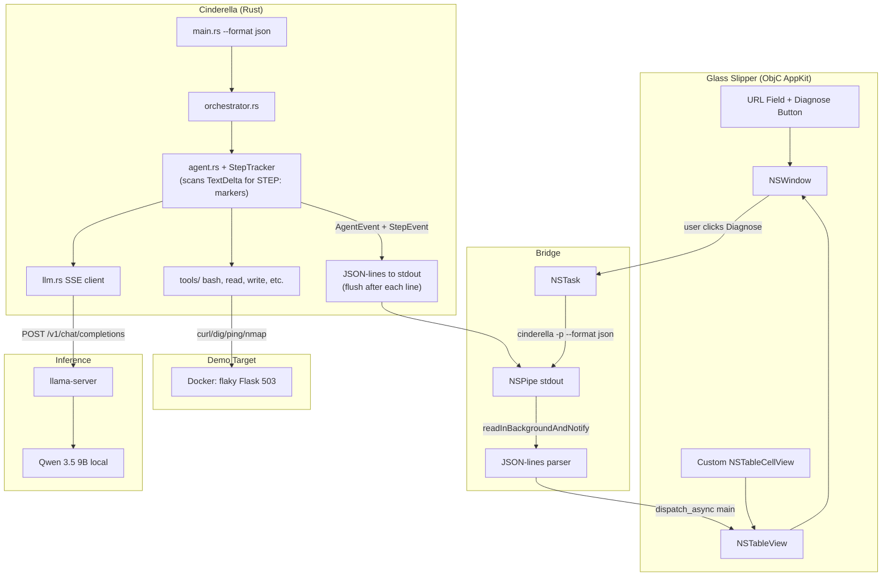
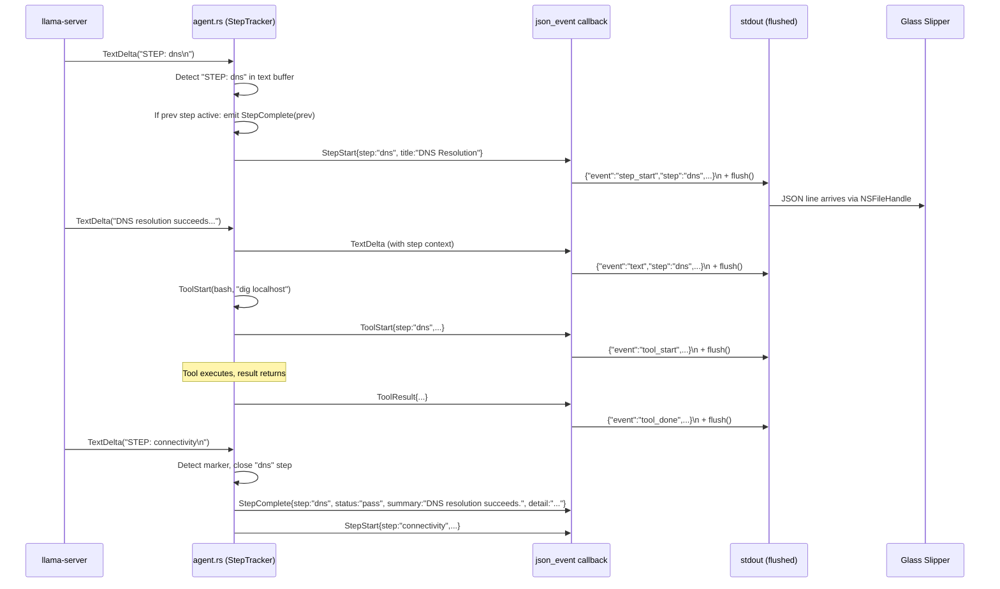

# Glass Slipper — Native macOS Diagnostic App

Created by /gauntlette-start on 2026-04-30
Branch: master (feature name: glass-slipper) | Repo: cinderella
Design doc: /Users/robertkarl/.gauntlette/designs/cinderella/glass-slipper-design-20260430-165522.md

## Problem Statement

Cinderella's agent core works — Qwen 3.5 9B follows a network-debug runbook, runs diagnostic commands, and produces correct diagnoses via `cinderella -p`. But there's no native GUI. The output is a wall of terminal text. The thesis is that nothing ties together local inference + polished native UX + genuine model reasoning. Glass Slipper is the native macOS app that completes that triangle.

Weekend sprint (Thu 2026-04-30 to Mon 2026-05-03) for a YC Summer 2026 demo recording. The YC deadline is a forcing function — the real goal is proving the thesis.

## Vision

Open a native Mac app. Enter a URL. Click Diagnose. Watch chunky Transmission-style table rows populate in real time as a 35B MoE model — running locally on your homelab (or MacBook with sufficient RAM) — autonomously parses the target, resolves DNS, pings, traces routes, checks ports, curls the service, and synthesizes a diagnosis. Each row shows one of the 7 runbook steps: title, summary, detail text, and a big green checkmark or red exclamation mark. When it's done, you have a structured diagnosis — not a terminal dump, but a diagnostic report that looks like it belongs on macOS.

## Planning Mode

BUILDER — Weekend sprint to a YC demo recording. Interview focused on taste (Transmission-style chunky cells over terminal-in-a-window), scope (one playbook, structured JSON output, recordable demo), and architecture (runbook-aware events from Rust, not heuristic parsing in ObjC).

## Feature Spec

### Rust CLI changes: `--format json` with runbook-aware events

Add `--format json` flag to `-p` mode. When set, the agent loop emits JSON-lines to stdout instead of plain text. Events include step-level semantics from the runbook.

**Event types (JSON-lines, one per line):**

```json
{"event":"step_start","step":"parse_target","title":"Parse Target"}
{"event":"text","step":"parse_target","content":"Investigating http://localhost:14094 — hostname: localhost, port: 14094, protocol: HTTP"}
{"event":"step_complete","step":"parse_target","status":"pass","summary":"Target parsed","detail":"localhost:14094 over HTTP"}
{"event":"step_start","step":"dns","title":"DNS Resolution"}
{"event":"tool_start","step":"dns","tool":"bash","command":"dig localhost"}
{"event":"tool_output","step":"dns","output":"...dig output...","truncated":false}
{"event":"tool_done","step":"dns","tool":"bash","exit_code":0}
{"event":"text","step":"dns","content":"DNS resolution succeeds. localhost resolves to 127.0.0.1."}
{"event":"step_complete","step":"dns","status":"pass","summary":"Verified via dig","detail":"dig returned 127.0.0.1"}
{"event":"step_start","step":"connectivity","title":"Connectivity Check"}
...
{"event":"step_start","step":"route_analysis","title":"Route Analysis"}
...
{"event":"step_start","step":"port_check","title":"Port Check"}
...
{"event":"step_start","step":"service_check","title":"Service Check"}
...
{"event":"step_complete","step":"service_check","status":"fail","summary":"Intermittent 503 errors","detail":"~30% failure rate detected across 10 requests"}
{"event":"step_start","step":"synthesis","title":"Diagnosis"}
{"event":"text","step":"synthesis","content":"## Diagnosis\n\n**What's working:** ..."}
{"event":"step_complete","step":"synthesis","status":"warn","summary":"App-level 503s","detail":"Werkzeug/Flask returning 503s periodically"}
{"event":"done","status":"complete"}
```

**RunbookStep concept:** The network-debug runbook defines named steps: `parse_target`, `dns`, `connectivity`, `route_analysis`, `port_check`, `service_check`, `synthesis`. The Rust agent tracks which step is active based on prompt markers in the model's text output. Step transitions are emitted as `step_start`/`step_complete` events.

**Step classification strategy:** Prompt markers. The system prompt instructs the model to emit `STEP: <step_name>` before each diagnostic step. The StepTracker maintains a **line buffer** for incoming TextDelta text, scanning for `STEP:` markers only on complete lines (after `\n`). This is necessary because SSE TextDelta events are token-sized fragments — `STEP: dns` will arrive across 3-4 separate callbacks. Without line buffering, no step transitions fire. When a `STEP:` marker is detected on a completed line, the StepTracker emits `StepComplete` for the previous step (if any) and `StepStart` for the new step. On `TurnComplete`, the StepTracker flushes — emitting `StepComplete` for whatever step is currently active (this closes the final step, e.g. `synthesis`, which has no subsequent marker). This avoids brittle command-pattern matching (both port_check and service_check use `curl` with different flags — a command classifier would need flag parsing). The model already labels steps with headers; adding a machine-parseable marker is minimal prompt change.

Step marker format added to NETWORK_DEBUG_PROMPT:
```
Before starting each step, output exactly: STEP: <step_name>
Valid step names: parse_target, dns, connectivity, route_analysis, port_check, service_check, synthesis
```

The `step_complete` event's `summary` field is the first line of the model's text output for that step (split on `\n`, not sentence-boundary detection — avoids garbled summaries from IPs like "127.0.0.1" and markdown headers). The `detail` field is all accumulated text for the step. The `status` field is derived from tool exit codes during the step: all success → `pass`, any failure → `fail`, mixed/warnings → `warn`. Steps with no tool calls (e.g. `parse_target`, `synthesis`) default to `pass`.

**Backward compatibility:** Without `--format json`, `-p` mode behaves exactly as today (plain text to stdout).

**CRITICAL: stdout flush.** When stdout is piped (NSTask + NSPipe), Rust switches from line-buffered to block-buffered (~8KB). Every JSON line emission MUST be followed by `io::stdout().flush().unwrap()`. Without this, the demo shows nothing for seconds, then a burst. This is the #1 silent-failure risk.

### ObjC AppKit app: glass-slipper/

**Build system:** Makefile + clang. No Xcode project, no XIBs. All UI is programmatic AppKit.

**Window structure:**
- Top area: minimal input controls — URL text field, Diagnose/Stop button. Information-sparse, following Console.app / Activity Monitor convention. Not a cramped toolbar. Diagnose button toggles to "Stop" while a diagnosis is running; clicking Stop calls `[task terminate]` on the NSTask. Button reverts to "Diagnose" on completion or termination.
- Main area: `NSTableView` with custom `NSTableCellView` subclass for chunky Transmission-style rows.
- No sidebar, no split pane.

**Table cell layout (each row):**

```
┌─────────────────────────────────────────────────────────┬─────────┐
│ DNS Resolution                              (title)     │         │
│ Verified via dig.                           (summary)   │   ✓     │
│ dig returned 127.0.0.1                      (detail)    │  (big)  │
└─────────────────────────────────────────────────────────┴─────────┘
```

- Left side: title (bold, larger), summary (regular), detail (smaller, gray)
- Right side: large status indicator — green checkmark (pass), red exclamation (fail/partial), spinner (in progress)
- Row height: ~80-100pt (chunky, not cramped)

**Data flow:**
1. User enters URL, clicks Diagnose
2. App constructs command using NSTask argument array (NOT shell interpolation — prevents injection): `@[@".", @"-p", prompt, @"--playbook", @"network-debug", @"--format", @"json"]`
3. NSTask launches the command, stdout piped via NSPipe
4. NSFileHandle readInBackgroundAndNotify reads lines as they arrive
5. Each JSON line is parsed, mapped to a table row (keyed by `step` field)
6. `step_start` → add new row with spinner
7. `tool_start`/`tool_done`/`text` → update detail text on existing row
8. `step_complete` → update summary, detail, and status indicator (checkmark/exclamation)
9. `done` → diagnosis is complete

**Error handling:**
- NSTask launch failure (cinderella not found): show alert, suggest building cinderella first
- Process exits non-zero: show error in a final table row, displaying stderr content (see below)
- Malformed JSON line: skip it, log to console

**stderr pipe:** NSTask must also pipe stderr via a second NSPipe. On non-zero exit, the app reads accumulated stderr content and displays it in the error table row. Without this, errors like "Failed to connect to llama-server" produce an empty table with no explanation.

**Threading:**
- NSTask runs on a background thread (automatic with NSPipe + readInBackgroundAndNotify)
- All NSTableView updates dispatch to main thread via `dispatch_async(dispatch_get_main_queue(), ...)`

## Scope

| Item | Decision | Effort | Why |
|------|----------|--------|-----|
| `--format json` flag in Rust CLI | ACCEPTED | M | Required for structured app communication |
| RunbookStep tracking in Rust agent | ACCEPTED | S | Prompt markers are simpler than command classification (eng review finding) |
| Step classification via prompt markers | ACCEPTED | S | Model emits STEP: markers, Agent scans TextDelta. No command-pattern matching needed. |
| ObjC AppKit app with Makefile | ACCEPTED | M | The whole point of this feature |
| Transmission-style chunky table rows | ACCEPTED | M | Core visual design decision |
| Custom NSTableCellView subclass | ACCEPTED | S | Required for the chunky row layout |
| URL input + Diagnose/Stop button | ACCEPTED | S | Minimal input surface; Stop calls [task terminate] |
| stderr pipe from NSTask | ACCEPTED | S | Required to show error messages on non-zero exit |
| NSTask + NSPipe integration | ACCEPTED | S | Shells out to cinderella binary |
| Row expand/disclosure for full output | DEFERRED | M | Nice for exploring raw tool output, but not needed for demo recording |
| Service type popup selector | DEFERRED | S | Only one playbook exists. Remove the selector entirely for now |
| Multiple playbooks in the app | DEFERRED | L | v2. Architecture supports it (step names are dynamic) but UI only has one path |
| App icon | DEFERRED | S | Not needed for demo |
| NSTask working directory for Finder launch | DEFERRED | S | Network-debug doesn't read project files; revisit if adding playbooks that do |
| Dark mode support | DEFERRED | S | AppKit gives basic dark mode for free, but custom colors need work |
| Window state persistence | DEFERRED | S | Not needed for demo |

## Resolved Decisions

| Decision | Why | Rejected |
|----------|-----|----------|
| Makefile + clang, no Xcode project | Agent-friendly iteration on .m files. No xcodeproj XML. User knows ObjC. | Xcode project (hostile to agent development) |
| Transmission-style chunky table rows | Dense but readable. Natural fit for diagnostic steps. Looks like a real Mac app, not a terminal wrapper. | Terminal-style NSTextView (too plain), toolbar + content area (not information-dense enough), split pane (too complex) |
| Structured JSON from Rust, not text parsing in ObjC | Reliable protocol. Model output unchanged. Agent loop already has the event boundaries. | App-side text parsing (fragile), hybrid markers in plain text (half-measure) |
| Runbook-aware steps (Approach B) over minimal JSON bridge (Approach A) | Explicit step boundaries give the app a reliable protocol. Worth the extra Rust work for robustness and future playbook support. | Minimal JSON bridge (heuristic step inference), thin shell (fragile text parsing) |
| Step classification via prompt markers (not command matching) | Eng review: both port_check and service_check use `curl` with different flags. Command-pattern matching requires flag parsing — brittle. Prompt markers (`STEP: <name>`) are 5 lines of Rust, rely on model compliance (which is already good — model labels steps with headers). | Command-pattern matching (curl flag disambiguation), app-side inference (wrong layer) |
| Step tracking state lives in Agent struct | Agent already owns the event loop and knows tool boundaries. Step tracker scans TextDelta for STEP markers and emits StepStart/StepComplete as native AgentEvents. Callback is a pure serializer. | Callback-side StepTracker (mixes serialization with step logic) |
| Summary = first line (split on newline), detail = full text | Fresh-eyes review: "first sentence" breaks on IPs ("127.0.0.1"), HTTP versions, markdown. First line is robust and deterministic. | Split-on-period (garbled by IPs), prompt-instructed SUMMARY/DETAIL markers (more prompt coupling), LLM re-inference (overkill) |
| Explicit stdout flush after each JSON line | Eng review: piped stdout is block-buffered (~8KB), not line-buffered. Without flush, demo shows nothing then burst. 1 line of code, impossible to miss. | LineWriter wrapper (slightly more plumbing), no fix (demo-breaking) |
| Information-sparse top bar | Console.app and Activity Monitor convention. URL is not a toolbar item. | Cramming URL + popup + button into NSToolbar (visually busy) |
| One playbook, no service type selector | Only network-debug exists. Don't show a popup with one option. | Service type popup (premature, only one option) |
| All 7 runbook steps mapped to step IDs | Protocol must match the actual runbook in config.rs. No silent drops. CEO review caught 5-vs-7 mismatch. | Collapsing parse_target and route_analysis (hides real diagnostic work from the user) |
| Demo model is Qwen 3.5 9B | 35B-MoE in config.rs doesn't fit on the demo Mac. Demo runs 9B. config.rs BUNDLED_MODEL still says 35B-MoE — that's a separate fix (multi-model or runtime override). | 35B-MoE (too large for demo hardware) |
| NSTask uses argument arrays, not shell interpolation | Prevents URL injection. NSTask with launchPath + arguments does not invoke a shell. | Shell string construction (injection risk) |
| StepTracker uses line-buffered scanning | Fresh-eyes review: SSE TextDelta events are token-sized fragments. Without line buffering, STEP: markers split across chunks are never detected. Same pattern as NSPipe line buffer. | Per-chunk scanning (never detects markers) |
| StepTracker flushes on TurnComplete | Fresh-eyes review: final step (synthesis) has no subsequent STEP: marker. Without flush, last row keeps spinner forever. | Only flush on next marker (last step never completes) |
| Steps with no tool calls default to pass | Fresh-eyes review: parse_target and synthesis have zero tool calls. Status derivation from exit codes has no signal. Default to pass. | Undefined behavior (no status assigned) |
| NSTask pipes stderr via second NSPipe | Fresh-eyes review: errors (e.g. llama-server unreachable) go to stderr. Without piping it, non-zero exit shows empty table with no explanation. | stdout-only pipe (silent errors) |
| Diagnose button toggles to Stop | Fresh-eyes review: no cancel = stuck 60s+ on wrong URL during demo. [task terminate] on click. | No cancel (force-quit only) |
| `--format json` not `--output json` | Fresh-eyes review: --output conventionally means output file path. --format avoids future collision. | --output json (name collision risk) |

## Codebase Health

STATUS: HEALTHY

- Stack: Rust 2021, tokio async, reqwest, crossterm, serde, clap 4, yah-core bash safety
- Structure: Single crate, flat src/ layout, 14 source files, ~2.9K lines. Clean.
- Test coverage: 34 tests (config, tools, llm parsing). No integration tests against live llama-server.
- Documentation: README with Cindy transcript, CINDY-DEV-GOALS.md, CHANGELOG.md, cocoa plan (SHIPPED)
- Dependency freshness: Current (crossterm 0.28, reqwest 0.12, tokio 1, serde 1, clap 4)
- Git hygiene: Clean. 14 commits on master.

## Relevant Code

**Agent event system:** `src/agent.rs:19-42` — `AgentEvent` enum. This is what gets serialized to JSON. Needs new variants for `StepStart` and `StepComplete`.

**Agent loop:** `src/agent.rs:82-282` — `Agent::process_message()`. The callback `|event| { ... }` is where events are emitted. Step tracking logic hooks in here — Agent scans TextDelta for `STEP:` markers, maintains current step state, emits StepStart/StepComplete.

**Prompt mode entry:** `src/orchestrator.rs:190-207` — `run_prompt()`. Currently calls `tui::print_event`. With `--format json`, calls a JSON serializer instead.

**CLI arg parsing:** `src/main.rs:17-50` — `Cli` struct. Add `--format json` flag here.

**System prompt (network-debug):** `src/config.rs:130-182` — the runbook that defines the diagnostic steps. Add `STEP: <name>` marker instruction here.

**TUI plain-text printer:** `src/tui.rs:239-299` — `print_event()` function. The JSON output mode is the analog of this.

**OrchestratorConfig:** `src/orchestrator.rs:13-27` — needs `format_json: bool` field.

## Relevant Design History

- `cocoa` design: `/Users/robertkarl/.gauntlette/designs/cinderella/cocoa-design-20260430-122556.md` — Phase 2 AppKit spec was thin (URL field, popup, NSTextView). Glass Slipper supersedes that spec with Transmission-style rows and structured JSON protocol.
- `init` design: `/Users/robertkarl/.gauntlette/designs/cinderella/init-design-20260422-170500.md` — original v0.1.0 agent architecture.

## Open Wounds

- `config.rs:34` has `sha256: "TODO_FILL_AFTER_DOWNLOAD"` — model checksum not filled in. Not blocking.
- `tools/bash.rs:167` has `// TODO: wire TUI confirmation flow for interactive approval` — not blocking for -p mode (no interactive approval needed).

## Tech Debt

- 2 TODOs in source (listed above). Neither blocks glass-slipper.
- No integration tests against live llama-server.
- Context management uses rough chars/4 token estimation.

## Out of Scope

| Item | Notes |
|------|-------|
| Multiple playbooks in the app | Architecture supports it (dynamic step names) but only network-debug ships |
| Playbook authoring / user-authored runbooks | v2+ |
| Fleet mode (multiple hosts) | v2+ |
| Row expand/disclosure for raw output | Nice but not needed for demo |
| App icon | Not needed for demo |
| Styled/colored output text | Plain text in detail view is enough |
| brew install distribution | Post-demo |

## Architecture

### Mermaid: Architecture



### Mermaid: Data Flow (Step Classification)



### ASCII: Architecture

```
┌─────────────────────────────────────────────────────────┐
│  Glass Slipper (ObjC AppKit, Makefile + clang)          │
│                                                         │
│  ┌─────────────────────────────────────────────────┐    │
│  │ URL: [http://localhost:14094____]  [Diagnose]    │    │
│  ├─────────────────────────────────────────────────┤    │
│  │ ┌───────────────────────────────────────┬─────┐ │    │
│  │ │ Parse Target                         │     │ │    │
│  │ │ Target parsed                        │  ✓  │ │    │
│  │ │ localhost:14094 over HTTP            │     │ │    │
│  │ ├───────────────────────────────────────┼─────┤ │    │
│  │ │ DNS Resolution                       │     │ │    │
│  │ │ Verified via dig                     │  ✓  │ │    │
│  │ │ dig returned 127.0.0.1              │     │ │    │
│  │ ├───────────────────────────────────────┼─────┤ │    │
│  │ │ Connectivity Check                   │     │ │    │
│  │ │ Ping succeeds, low latency           │  ✓  │ │    │
│  │ │ 3/3 packets, 0.17ms avg             │     │ │    │
│  │ ├───────────────────────────────────────┼─────┤ │    │
│  │ │ Route Analysis                       │     │ │    │
│  │ │ Direct route, 1 hop                  │  ✓  │ │    │
│  │ │ traceroute: localhost → 127.0.0.1    │     │ │    │
│  │ ├───────────────────────────────────────┼─────┤ │    │
│  │ │ Port Check                           │     │ │    │
│  │ │ Port 14094 open                      │  ✓  │ │    │
│  │ │ nc -zv succeeded                    │     │ │    │
│  │ ├───────────────────────────────────────┼─────┤ │    │
│  │ │ Service Check                        │     │ │    │
│  │ │ Intermittent 503 errors              │  !  │ │    │
│  │ │ ~30% failure rate, 10 requests       │     │ │    │
│  │ ├───────────────────────────────────────┼─────┤ │    │
│  │ │ Diagnosis                            │     │ │    │
│  │ │ Werkzeug/Flask returning 503s        │  ●  │ │    │
│  │ │ periodically. App-level issue.       │     │ │    │
│  │ └───────────────────────────────────────┴─────┘ │    │
│  └─────────────────────────────────────────────────┘    │
│         │ NSTask + NSPipe (argument array, no shell)    │
│         ▼                                               │
│  cinderella . -p "..." --playbook network-debug         │
│                         --format json                   │
├─────────────────────────────────────────────────────────┤
│  cinderella (Rust)                                      │
│                                                         │
│  main.rs ──► orchestrator.rs ──► run_prompt()           │
│                                    │                    │
│                     ┌──────────────┴──────────────┐     │
│                     │ --format json?              │     │
│                     │  yes: json_event() callback │     │
│                     │  no:  print_event() as today│     │
│                     └──────────────┬──────────────┘     │
│                                    ▼                    │
│  agent.rs: process_message() loop                       │
│    StepTracker scans TextDelta for "STEP: <name>"       │
│    Emits StepStart/StepComplete as native AgentEvents   │
│    stdout flush() after each JSON line                  │
│                                                         │
├─────────────────────────────────────────────────────────┤
│  llama-server → Qwen 3.5 9B (local) or 35B MoE (homelab)   │
├─────────────────────────────────────────────────────────┤
│  Docker: Flask app, 503 every 3rd request               │
└─────────────────────────────────────────────────────────┘
```

### Failure Matrix

| Failure | Trigger | What User Sees | What Logs Show | Plan Covers? |
|---------|---------|---------------|----------------|--------------|
| cinderella not in PATH | NSTask launch fails | Alert dialog: "cinderella not found" | NSTask terminationStatus | YES |
| llama-server not running | cinderella exits non-zero | Error row in table: "Failed to connect to llama-server" | stderr in NSPipe | YES |
| Model doesn't emit STEP markers | Model ignores prompt instruction | All events land in a single "unknown" row, or no step transitions | JSON events have no step_start | PARTIAL — app renders unknown steps generically, but demo quality degrades. Mitigation: test with actual model before demo. |
| Malformed JSON from Rust | Bug in serializer | Line skipped, console log | NSLog in JSON parser | YES |
| stdout buffering (no flush) | Piped stdout block-buffers | Nothing for 5-10s, then burst | No obvious log — silent | YES (eng review added explicit flush requirement) |
| NSPipe partial line | Large JSON line split across read callbacks | JSON parse error on fragment | NSLog "invalid JSON" | PARTIAL — need line buffer in NSFileHandle callback to accumulate until newline |
| Process killed mid-diagnosis | User closes app, cinderella killed | Incomplete table, no "done" event | NSTask terminationStatus != 0 | YES — process exits non-zero path |
| Demo target not running | Docker container down | All steps pass until service_check, which fails | Tool output shows connection refused | YES — this is a valid diagnosis |
| Context window exhaustion | Long diagnosis, many tool calls | Agent warns "Context X% full" then stops | Warning event in JSON | YES — existing agent behavior |
| traceroute hangs | No response from hops | Timeout after 15s (in system prompt), tool result shows timeout | Tool output: "Command timed out after 120s" | YES — bash timeout handles it |

### Test Matrix

```
Component              | Happy Path | Error Path | Edge Cases    | Integration
───────────────────────┼────────────┼────────────┼───────────────┼────────────
StepTracker (Rust)     |     □      |     □      |     □         |     □
  - STEP: marker parse |  detect 7  | no markers | partial line  |     —
  - summary extraction |  1st sent  | empty text | multi-sentence|     —
  - status derivation  |  pass/fail | no tools   | mixed results |     —
AgentEvent JSON serial |     □      |     □      |     □         |     □
  - all event types    |  round-trip| bad UTF-8  | empty fields  |     —
  - stdout flush       |  each line |     —      |     —         |  piped test
--format json flag     |     □      |     □      |     □         |     □
  - flag plumbing      |  orch→agent|  no -p     |  -p without --output |  —
  - backward compat    |  plain text|     —      |     —         |     —
NSTask + NSPipe (ObjC) |     □      |     □      |     □         |     □
  - process launch     |  success   |  not found |     —         |     —
  - line buffering     |  complete  |  partial   |  empty line   |     —
  - thread dispatch    |  main queue|     —      |  rapid events |     —
DiagnosticStepCell     |     □      |     □      |     □         |     □
  - layout             |  3 labels  |  missing   |  long text    |     —
  - status indicator   |  ✓ ! ●    |     —      |  transition   |     —
End-to-end             |     —      |     —      |     —         |     □
  - demo flow          |     —      |     —      |     —         |  app→cindy→diagnosis
  - recordable quality |     —      |     —      |     —         |  visual check
```

### JSON-lines Protocol

```
Direction: cinderella stdout → glass-slipper stdin (NSPipe)
Format: one JSON object per line (newline-delimited JSON / NDJSON)
Encoding: UTF-8
CRITICAL: Each line MUST be followed by stdout flush().

Events:

  step_start    {"event":"step_start","step":"<id>","title":"<display name>"}
  tool_start    {"event":"tool_start","step":"<id>","tool":"bash","command":"<cmd>"}
  tool_output   {"event":"tool_output","step":"<id>","output":"<text>","truncated":<bool>}
  tool_done     {"event":"tool_done","step":"<id>","tool":"bash","exit_code":<int>}
  text          {"event":"text","step":"<id>","content":"<model text>"}
  thinking      {"event":"thinking","content":"<model thinking>"}
  step_complete {"event":"step_complete","step":"<id>","status":"pass|fail|warn",
                 "summary":"<first sentence of step text>",
                 "detail":"<all accumulated text for step>"}
  done          {"event":"done","status":"complete|error","message":"<optional>"}

Step IDs for network-debug playbook (all 7, matching config.rs runbook):
  parse_target, dns, connectivity, route_analysis, port_check, service_check, synthesis

Unknown events or step IDs: the app should render them generically (use the
step ID as the title) rather than crash. This allows new playbooks to work
without app changes.

NSPipe partial-line handling: the ObjC JSON parser MUST buffer incoming data
and split on newlines, not assume each readInBackground callback delivers
exactly one complete line.
```

## Implementation Approaches

### Approach A: Minimal JSON bridge
Add `--format json` to CLI. Each AgentEvent becomes a JSON line. ObjC app infers step from command name.
- Effort: M | Risk: Low | Completeness: 7/10
- Reuses: existing agent, -p mode, AgentEvent enum

### Approach B: Runbook-aware structured output (CHOSEN)
Same as A, plus RunbookStep tracking in Rust. Explicit step_start/step_complete events. Step classification via prompt markers (eng review revision).
- Effort: M | Risk: Low-Medium | Completeness: 9/10
- Reuses: existing agent, -p mode, AgentEvent enum, system prompt step structure

### Recommended
Approach B. Explicit step boundaries from Rust. Step classification via prompt markers (`STEP: <name>`) — simpler than command-pattern matching, avoids curl flag disambiguation. The model already follows the runbook (validated by Cindy transcript).

## Implementation

Files to modify:
- `src/agent.rs` — add `StepStart`/`StepComplete` variants to AgentEvent; add StepTracker struct that scans TextDelta for `STEP: <name>` markers; maintain current_step state; emit step events in process_message(); derive status from tool exit codes, summary from first sentence of step text
- `src/config.rs` — add `STEP: <step_name>` marker instruction to NETWORK_DEBUG_PROMPT with the list of valid step names
- `src/main.rs` — add `--format json` CLI flag; pass through OrchestratorConfig
- `src/orchestrator.rs` — add `format_json: bool` to OrchestratorConfig; in run_prompt(), choose between print_event() and json_event() callback
- `src/tui.rs` — add json_event() function that serializes AgentEvent (including new step variants) to JSON-lines with stdout flush after each line

Files to create:
- `glass-slipper/Makefile` — clang build for the ObjC app (include `.d` dependency generation for header changes, or consolidate to fewer `.m` files)
- `glass-slipper/main.m` — app delegate, window setup, NSTask launch, NSPipe line buffering, JSON parsing
- `glass-slipper/DiagnosticStepCell.m` — custom NSTableCellView subclass for chunky rows
- `glass-slipper/DiagnosticStepCell.h` — header for the cell
- `glass-slipper/AppDelegate.h` — header
- `glass-slipper/Info.plist` — minimal app plist

Files to delete: none

Implementation order:
1. **System prompt update** — Add `STEP: <step_name>` marker instruction to NETWORK_DEBUG_PROMPT in config.rs. List all 7 valid step names.
2. **StepTracker + AgentEvent variants** — Add StepStart/StepComplete to AgentEvent. Add StepTracker struct to agent.rs: scans TextDelta for `STEP:` markers, tracks current step, accumulates text per step, derives summary (first sentence) and status (from tool exit codes). Wire into process_message().
3. **`--format json` flag + json_event()** — Add CLI flag to main.rs, plumb `format_json: bool` through OrchestratorConfig, write json_event() in tui.rs that serializes all AgentEvent variants to JSON-lines. **Flush stdout after every line.**
4. **Test JSON output against demo target** — Run `cinderella -p --format json --playbook network-debug` against the flaky Flask container. Verify: well-formed NDJSON, all 7 step_start events, step_complete with summary/detail, correct status values.
5. **ObjC app scaffold** — Makefile, main.m, AppDelegate, NSWindow, minimal URL input + button. Verify it compiles and shows a window.
6. **NSTask + NSPipe integration** — Launch cinderella via NSTask with argument array (no shell). Read stdout via NSFileHandle with line-buffered parser (accumulate until newline, then parse JSON). Log parsed events to console. Verify events arrive in real time (not burst).
7. **Custom table cell + NSTableView** — DiagnosticStepCell with title/summary/detail/status indicator. Populate from parsed JSON events. Wire up data source. Step-keyed dictionary for row lookup.
8. **Polish and demo prep** — Window sizing, font choices, status indicator colors/sizing, test full flow, record.

Checkpoints:
1. `cinderella -p --format json --playbook network-debug` produces well-formed JSON-lines with step_start/step_complete events against the demo target
2. ObjC app compiles with `make`, shows a window with URL input and button
3. Clicking Diagnose launches cinderella via NSTask and rows populate in real time (not burst)
4. Full demo flow is recordable: launch app → enter URL → click Diagnose → watch rows populate → see diagnosis with green/red indicators

### Implementation Results

**Commits:**
- `3e1786a` — Add --format json mode with runbook-aware step tracking (Rust: agent.rs, config.rs, main.rs, orchestrator.rs, tui.rs)
- `a2f4ad5` — Add Glass Slipper native macOS diagnostic app (ObjC: 6 files in glass-slipper/)

**Files modified (Rust):**
- `src/config.rs` — Added STEP: marker instruction to NETWORK_DEBUG_PROMPT with all 7 step names
- `src/agent.rs` — Added StepStart/StepComplete/StepStatus to AgentEvent, StepTracker struct with line-buffered marker scanning, wired into process_message(), flush on all exit paths. 10 unit tests.
- `src/main.rs` — Added `--format` CLI flag (text|json), validation, plumbed to OrchestratorConfig
- `src/orchestrator.rs` — Added `format_json: bool` to OrchestratorConfig, run_prompt() branches between print_event() and json_event()
- `src/tui.rs` — Added json_event() serializer for all AgentEvent variants to JSON-lines, stdout flush after each line. StepStart/StepComplete no-ops in print_event().

**Files created (ObjC):**
- `glass-slipper/Makefile` — clang build, .app bundle
- `glass-slipper/Info.plist` — minimal app plist
- `glass-slipper/AppDelegate.h` — header with NSTableView data source/delegate
- `glass-slipper/DiagnosticStepCell.h` / `.m` — custom NSTableCellView, 88pt chunky rows, title/summary/detail/status indicator (checkmark/exclamation/spinner)
- `glass-slipper/main.m` — AppDelegate impl, NSTask+NSPipe integration, line-buffered JSON parser, NSTableView wiring, Diagnose/Stop toggle, stderr pipe, cinderella binary discovery

**Tests:** 44 total (10 new StepTracker + 34 existing), all passing.

**Deviations from plan:** None.

## Priorities

1. **JSON-lines protocol correctness** — the contract between Rust and ObjC must be solid
2. **stdout flush on every line** — without this, the demo silently fails (shows burst not stream)
3. **NSPipe line buffering** — accumulate until newline in the ObjC reader
4. **Chunky table cell visual quality** — this is what the camera sees
5. **End-to-end demo flow** — app → cinderella → diagnosis → structured results
6. **Polish** — fonts, spacing, indicator sizing, window proportions

## Gauntlette Review Report

| Review | Trigger | Runs | Status | Findings |
|--------|---------|------|--------|----------|
| Planning Kickoff | `/gauntlette-start` | 1 | DONE | Builder mode. Transmission-style chunky table rows. Runbook-aware JSON-lines protocol from Rust. Makefile + clang, no Xcode. One playbook (network-debug). Weekend sprint to demo recording. |
| CEO Review | `/gauntlette-ceo-review` | 1 | CLEAR | HOLD. Scope is right. Fixed 3 bugs: step ID mismatch (5 vs 7), model name consistency (demo runs 9B, config.rs has 35B-MoE — noted), date (Fri → Thu). JSON protocol is keeper infra, ObjC app is demo vehicle — honest split. |
| Design Review | `/gauntlette-design-review` | 0 | — | — |
| Engineering Review | `/gauntlette-eng-review` | 1 | CLEAR | 4 findings, all resolved: (1) Step classification changed from command-pattern matching to prompt markers — avoids curl flag disambiguation. (2) stdout flush required after every JSON line — piped stdout is block-buffered. (3) Step tracking state lives in Agent struct, not callback. (4) Summary = first sentence, detail = full text — deterministic extraction. Added failure matrix, test matrix, data flow diagram, NSPipe line-buffering requirement, NSTask argument array (no shell injection). |
| Fresh Eyes | `/gauntlette-fresh-eyes` | 1 | CLEAR | 11 findings (2 critical, 5 important, 4 minor). User accepted 7, deferred 1 (NSTask cwd), noted 2 (thinking step field, tool_output/tool_done split). Critical fixes: StepTracker line buffering, stderr pipe. Also: final-step flush, summary=first-line, no-tool-call default status, cancel button, --format rename, Makefile .h deps. |
| Implementation | `/gauntlette-implement` | 1 | DONE | Rust: StepTracker with line-buffered STEP: marker scanning, json_event() serializer, --format json flag. 10 unit tests. ObjC: AppKit app with Makefile+clang, Transmission-style 88pt table rows, NSTask+NSPipe with line-buffered JSON parser, Diagnose/Stop toggle, stderr pipe. 2 atomic commits. 44/44 tests pass. |
| Code Review | `/gauntlette-code-review` | 1 | PASS | Large tier (1828 lines, 2 adversarial subagents). 11 findings total. Fixed: (1) should_force_tool_use() dropped step events — now returns events for caller to emit. (2) UTF-8 decode failure in ObjC lineBuffer caused unbounded growth — now clears buffer. (3) NSTask Stop has SIGKILL fallback after 3s. Commented: pipe race in taskDidTerminate. Skipped (user): protocol deviations (text/tool events lack step field, ToolResult hardcodes bash), model path hardcoded in ObjC, done event always says complete. 44/44 tests pass, ObjC builds clean. |
| QA | `/gauntlette-quality-check` | 0 | — | — |
| Human Review | `/gauntlette-human-review` | 0 | — | — |
| Ship It | `/gauntlette-ship-it` | 0 | — | — |

**VERDICT:** REVIEWED — Code review passed, proceed to /gauntlette-quality-check
