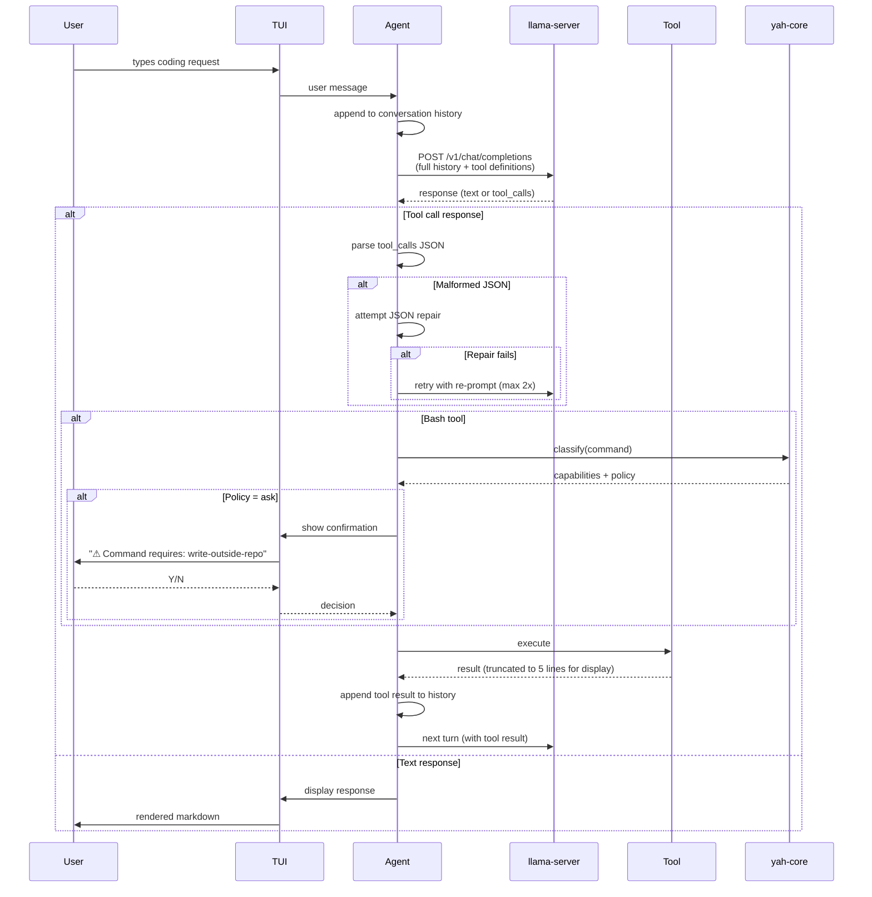

# Cinderella — The Shoe That Fits

Created by /gauntlette-start on 2026-04-22
Branch: init | Repo: cinderella
Design doc: /Users/robertkarl/.gauntlette/designs/cinderella/init-design-20260422-170500.md

## Problem Statement

Cloud AI coding tools are bleeding developers with unstable pricing ($20→$200→$100→$20) and declining quality. Local alternatives require assembling 3+ tools, hand-tuning quant sizes, context windows, and layer offloading. The result: capable Apple Silicon hardware sits idle while developers pay $100-200/month for cloud tools they increasingly distrust. Nobody ships one product that detects hardware, downloads the right model, serves it, and runs a coding agent with tools. The closest thing (hf agents run pi) is a 200-line shell script.

## Vision

`cinderella myprojectname` → you're coding with a local AI agent. No API keys. No config files. No model selection. One command. The shoe fits your hardware automatically.

The value is not the agent — dozens of open-source agents exist. The value is the orchestration: hardware detection → right model → right quant → sane server defaults → working tool-calling → observability. That entire chain, zero-config, in one binary. Dropbox for local AI coding: judgement and defaults, not novel technology.

v1 gates on a single model family (Qwen 3.5, multiple quant sizes for different RAM tiers). "Works perfectly with one model" beats "works maybe with five." Multi-model support is v2, after we have a test harness that validates tool-calling reliability per model.

## Planning Mode

PRODUCT — This targets career developers fleeing cloud AI pricing. The demand evidence is strong: 80+ upvote HN thread, multiple people asking "how are the offline agents?", llmfit at 24K stars in 2 months. The interview focused on demand reality, the specific pain of local setup, and the Dropbox-style "judgement and defaults" value proposition.

## Feature Spec

The user downloads cinderella from the website (one green button, ~6.3GB). Extracts it. Runs `cinderella myprojectname`. Cinderella:

1. **Detects hardware** — Reads total/available RAM via sysctl. Displays a one-line summary: "M3 Pro, 18GB unified, 12GB available for model."
2. **Extracts bundled model** — On first run, copies the bundled Qwen3.5-9B-abliterated Q4_K_M GGUF (~6.1GB) from the release archive to `~/.cinderella/models/`. Subsequent runs skip this step.
3. **Starts inference server** — Launches the bundled llama-server with tuned defaults: `--jinja`, correct context size, full GPU offload, no thinking tokens, explicit chat template for Qwen. Verifies all layers are on GPU. If RAM is too low, tells the user to close apps.
4. **Launches coding agent** — Opens a TUI (Ratatui) in the specified project directory. The agent has tools: file read, file write, file edit, bash execution, ls. Uses llama-server's OpenAI-compatible API with tool_use.
5. **Shows observability** — Status bar displays: model name, quant, tok/s (live), memory usage, context utilization. Errors are surfaced with actionable messages, not stack traces.

The user types their coding request in natural language. The agent reads files, writes code, runs commands, and iterates — the same loop as Claude Code or Cursor agent mode, but entirely local.

## Scope

| Item | Decision | Effort | Why |
|------|----------|--------|-----|
| CLI binary (`cinderella myproject`) | ACCEPTED | M | Core entry point, proves the thesis |
| Bundled model (Qwen3.5-9B-abliterated Q4_K_M) in release artifact | ACCEPTED | S | One green button. No separate download. Airgapped works. |
| Bundled llama-server in release artifact | ACCEPTED | M | Zero external dependencies. User never installs anything separately. |
| HW detection via sysctl/sysinfo (no llmfit) | ACCEPTED | S | We control the model table. Just need available RAM. |
| Hardcoded model registry | ACCEPTED | S | Single model family, known URLs, known checksums. No dynamic discovery. |
| llama-server lifecycle management | ACCEPTED | M | Start, verify GPU offload, health check, auto-restart on crash |
| Agent loop (system prompt → LLM → tool parse → execute → loop) | ACCEPTED | M | Core agent functionality |
| Tool call reliability (JSON repair, retry, defensive parsing) | ACCEPTED | M | Existential risk. The product is worthless if tool calls don't work. |
| 5 tools: read, write, edit, bash, ls | ACCEPTED | M | Minimum viable tool set for coding. ls kept, monitored for usefulness. |
| Bash safety via yah-core | ACCEPTED | S | AST-based command classification. Real parser, not regex. |
| Ratatui TUI with observability status bar | ACCEPTED | L | Observability is v1, not v2. Claude Code parity keybindings raise effort from M to L. |
| Download with resume + SHA256 checksum | ACCEPTED | S | For BYOM and future model updates. HTTP Range + integrity check. |
| SSE streaming from llama-server | ACCEPTED | M | 500 tokens at 15 tok/s = 33s of blank screen without streaming. Non-negotiable for UX. |
| Context window management | ACCEPTED | M | 32K fills in 10-15 turns. Truncate tool results at context level, summarize old turns, warn at 80%. |
| Bash command timeout + kill | ACCEPTED | S | 120s default. SIGTERM process group, wait 5s, SIGKILL. Esc triggers same flow. |
| RAM check includes KV cache | ACCEPTED | S | KV cache for 32K context adds 2-4GB. RAM check must account for model + KV, not just model. Critical. |
| CDN hosting (Cloudflare R2) | ACCEPTED | S | GitHub Releases caps at 2GB/asset. 6.3GB artifact needs R2/S3. Free tier covers early users. |
| macOS code signing + notarization | ACCEPTED | S | Unsigned binaries trigger Gatekeeper dialogs. User has Apple dev account. CI step: codesign, notarize, staple. |
| brew install distribution | DEFERRED | S | Premature before product-market fit. Green button on website first. |
| macOS native GUI app | DEFERRED | XL | v2 after CLI proves out |
| Windows/Linux support | DEFERRED | L | macOS only for v1 |
| Multi-model routing | DEFERRED | L | v2 feature, needs v1 data on model performance |
| Model marketplace / auto-update | DEFERRED | M | v2, need to understand which models work first |
| Plugin system for custom tools | DEFERRED | M | v2, need to know what tools matter first |
| MCP server support | DEFERRED | M | Nice-to-have, not core thesis |

## Resolved Decisions

| Decision | Why | Rejected |
|----------|-----|----------|
| Rust for the binary | Target persona expects fast, native tools. Ratatui is Rust. yah-core is Rust. Consistent ecosystem. | Go (less native feel), Python (too slow, dependency hell), Swift (too Apple-specific for CLI) |
| Build agent from scratch (Approach C) | Zero licensing risk, we control architecture, agent loop is ~500 lines. The hard part is orchestration, not the agent. | Fork Pi Agent Rust (design baggage), Claw Code (unclear license) |
| macOS only for v1 | Follow local design patterns. Apple Silicon is the target hardware. Don't spread thin. | Cross-platform from day one |
| Minimum macOS 13 (Ventura) | All Apple Silicon Macs can run Ventura. Metal 3 support. llama.cpp Metal backend works on 13+. | macOS 14+ (excludes early adopters), macOS 12 (no Metal 3) |
| No Electron | Native rendering only. Claude Code's TUI-via-headless-browser is an anti-pattern. Ratatui for TUI. | Electron, web-based TUI |
| Observability in v1 | "Why am I getting 1.2 tok/s?" can't be a mystery. Performance dashboard, not log dumps. | Deferring to v2 |
| Drop llmfit, read RAM directly | With a hardcoded model registry and single model family, all we need is available RAM in GB. One syscall. llmfit is cool but earns nothing here. | llmfit-core as library (over-engineered for v1), llmfit as subprocess (external dependency) |
| Hardcoded model registry | Single model family (Qwen 3.5). Const table mapping RAM tiers to GGUF URLs + SHA256 checksums. Dead simple, works offline. | llmfit recommendation (no download URLs), HuggingFace API search (network dependency) |
| Bundle 9B GGUF in release | One green button on the website. ~6.3GB download, includes everything. Airgapped machines work. Nobody else does this. | Download on first run (breaks airgap), bundle smaller 4B (worse quality) |
| Bundle prebuilt llama-server | Zero external dependencies. User never runs brew install anything. CI compiles llama.cpp with Metal for Apple Silicon, packages it. | Require brew install llama.cpp (breaks one-command promise), download on first run (breaks airgap) |
| Two distribution paths | Website: one green button (~6.3GB, model + llama-server bundled). Nerds: `cargo install cinderella` + BYOM via `--model` flag. | Single artifact (forces 6GB on nerds), no BYOM (alienates HN crowd) |
| Single crate, flat src/ layout | One Cargo.toml, all files under src/. For a v1 greenfield project with one developer, workspace overhead buys nothing. | Cargo workspace (premature, slower builds, internal API boundaries to design) |
| llama-server for inference | Industry standard, OpenAI-compatible API, tool calling support. Bundled, not installed separately. | Ollama (less control), vLLM (overkill for local) |
| Persona A (pricing refugee) first | They have hardware, motivation, taste. Build for ourselves first. | Persona B (curious onlooker) |
| Claude Code parity keybindings | Target user is coming from Claude Code. Enter, Shift-Enter, Esc cancel, Up/Down scroll, /help, /clear. | Minimal (Enter + Ctrl-C only), custom bindings |
| Tool results always expanded | Local models make more mistakes — need max visibility. Truncated to 5 lines. | Collapsed with expand, streaming raw |
| Status bar: all 5 metrics always | User wants constant confirmation GPU offload didn't revert. tok/s, RAM, context, GPU layers, model name. | Dynamic-only (drop GPU after startup), adaptive width |
| Quant names: contextual display | Raw quant in status bar (compact). Quality/speed bars + explanation on download/recommendation screen. | Raw everywhere, translated everywhere |
| NO_COLOR + text indicators for a11y | Cheap accessibility baseline: respect NO_COLOR, use ✓ ✗ ⚠ alongside color. Screen reader deferred. | Skip a11y for v1, full a11y baseline |
| Single model family for v1 (Qwen 3.5) | Tool-calling reliability varies wildly between model families. Testing one deeply beats testing five shallowly. Qwen 3.5 has best local tool-use reports. | Model-agnostic (untested matrix), blessed list of 3+ models (too much QA surface) |
| Keep edit tool with exact-match guard | Edit fails safely if old_string not found — worst case is rejected edit, not corrupted file. Investigating local model tool-use quality is part of the thesis. | Drop edit (loses learning opportunity), edit without guard (dangerous) |
| yah-core for bash safety | AST-based shell command classification via tree-sitter-bash. 14 semantic capabilities, allow/ask/deny policies. Real parser, not a regex deny list. Already built and tested. | Regex deny list (fragile, bypassable), no guardrails (irresponsible), project-dir sandbox (too restrictive) |
| Auto-restart llama-server on crash | llama-server is stateless — conversation lives in cinderella. Crash loses nothing. Auto-restart + retry last call, max 3 attempts. One-line TUI warning. | Pause and ask user (interrupts flow for no reason) |
| Tool call reliability is first-class | JSON repair on malformed args (fix trailing commas, missing quotes). Retry with re-prompt on parse failure (max 2). Explicit --jinja + chat template. This is the existential risk. | Fail on malformed JSON (unusable with smaller models), ignore the problem |
| Tested model: Qwen3.5-9B-abliterated Q4_K_M | Confirmed working GGUF with tool calling. Abliterated variant. This is the bundled model. | Untested models, hypothetical model families |
| SSE streaming from llama-server | At 15 tok/s, 500 tokens = 33s blank screen without streaming. Text tokens stream live, tool calls buffer until complete. tok/s counter driven by stream chunk timing. | Atomic responses (unacceptable UX), defer streaming (same) |
| Context management: truncate + summarize | 32K context fills in 10-15 turns. Tool results truncated at context level (not just display) to ~100 lines/2K tokens. Old tool results replaced with one-line summaries after 10 turns. Warn at 80% capacity. | /clear only (losing all context every 10 minutes), no mitigation (silently broken) |
| Bash timeout: 120s + process group kill | Default 120s timeout. Esc or timeout sends SIGTERM to process group, waits 5s, then SIGKILL. Timeout error returned as tool result. | No timeout (hangs forever), short timeout (breaks cargo build) |
| RAM check includes KV cache overhead | 32K context KV cache adds 2-4GB on top of model weights. Pre-flight RAM check must require model_size + estimated_kv_cache. For 9B Q4_K_M + 32K ctx, require ~10GB available, not ~5GB. | Check model size only (misleading, causes swap thrashing) |
| CDN hosting via Cloudflare R2 | GitHub Releases caps at 2GB per asset. 6.3GB release artifact hosted on Cloudflare R2. Free tier: 10GB storage, 10M reads/month. Download page on R2 or project website. | GitHub Releases only (can't host 6.3GB), S3 (costs more) |
| macOS code signing + notarization | Unsigned binaries trigger Gatekeeper. User has Apple Developer account ($99/yr). CI: codesign both binaries (cinderella + llama-server), notarize the .tar.gz, staple ticket. | Unsigned (multi-step Gatekeeper bypass defeats zero-friction thesis) |

## Codebase Health

STATUS: GREENFIELD

- Stack: Rust (planned). No code yet — one commit with README.
- Structure: Empty repo, clean slate
- Test coverage: N/A
- Documentation: README with thesis and competitive analysis
- Dependency freshness: N/A
- Git hygiene: Single commit on `init` branch

## Relevant Code

No existing code to reference. Greenfield project.

Key external codebases to study:
- `Dicklesworthstone/pi_agent_rust` — Rust, MIT, 776 stars. Agent with 7 tools. Reference implementation.
- `instructkr/claw-code` — Rust, 187K stars. Claude Code clone. Reference for UX patterns (but unclear license).
- `srothgan/claude-code-rust` — Rust, Apache-2.0, 101 stars. Ratatui-based TUI for Claude Code. Reference for TUI patterns.
- `ggml-org/llama.cpp` — C++, MIT. llama-server with OpenAI-compatible API and tool calling.
- `~/Code/yah/` — Rust, owned by user. yah-core library for AST-based bash command safety classification.

## Relevant Design History

None. First design for this project.

## Open Wounds

None — greenfield repo, no tech debt.

## Tech Debt

N/A — no code yet.

## Out of Scope

- Windows/Linux support (v2+)
- Native macOS GUI app (v2, SwiftUI/Cocoa)
- Multi-model routing / model-agnostic support (v2, after test harness exists)
- Model marketplace / auto-update (v2)
- Plugin/extension system (v2)
- MCP server support (v2)
- Homebrew formula / tap (post-validation, when people are actually downloading it)
- Team/enterprise features
- Cloud model fallback (defeats the purpose)
- llmfit integration (not needed for v1 with hardcoded registry)

## Architecture

### Mermaid: Architecture

```mermaid
flowchart TD
    A["cinderella myproject"] --> B[Orchestrator]
    B --> C[sysctl: Read RAM]
    C --> D{Bundled GGUF cached?}
    D -->|No| E[Extract GGUF to ~/.cinderella/models/]
    D -->|Yes| F[Start bundled llama-server]
    E --> F
    F --> G{All layers on GPU?}
    G -->|No| H["Error: Close apps, free RAM"]
    G -->|Yes| I[Health Check]
    I --> J[Agent Loop]
    J --> K[TUI: Ratatui]
    K --> L[User Input]
    L --> M[LLM Call: /v1/chat/completions]
    M --> N{Tool call in response?}
    N -->|Yes| O{Parse tool JSON}
    O -->|Valid| P[Execute Tool]
    O -->|Malformed| Q[JSON Repair]
    Q -->|Fixed| P
    Q -->|Unfixable| R[Retry with re-prompt max 2x]
    R --> M
    P --> S{Bash tool?}
    S -->|Yes| T[yah-core: classify command]
    T --> U{Policy?}
    U -->|Allow| V[Run command]
    U -->|Ask| W[TUI confirmation prompt]
    W -->|Yes| V
    W -->|No| X[Return "denied by user"]
    U -->|Deny| X
    S -->|No| V
    V --> M
    N -->|No| Y[Display Response]
    Y --> L
    K --> Z[Status Bar: model, quant, tok/s, RAM, GPU]

    F -.->|crash| AA[Auto-restart max 3x]
    AA --> F
```

### Mermaid: Data Flow



### ASCII: Architecture

```
┌─────────────────────────────────────────────────────────────┐
│                    cinderella release artifact                │
│  ┌──────────────┐  ┌──────────────┐  ┌───────────────────┐  │
│  │ cinderella    │  │ llama-server │  │ qwen3.5-9b-q5km  │  │
│  │ (33 MB Rust)  │  │ (12 MB C++)  │  │ (6.1 GB GGUF)    │  │
│  └──────┬───────┘  └──────────────┘  └───────────────────┘  │
│         │                                                    │
├─────────▼────────────────────────────────────────────────────┤
│  Orchestrator                                                │
│  ┌──────────┐  ┌──────────────┐  ┌────────────────────────┐ │
│  │ sysctl   │→│ Extract GGUF  │→│ llama-server subprocess │ │
│  │ (RAM)    │  │ (first run)   │  │ --jinja --chat-template│ │
│  └──────────┘  └──────────────┘  └──────────┬─────────────┘ │
│                                              │               │
│  ┌───────────────────────────────────────────┤               │
│  │         Agent Loop                        │               │
│  │  ┌──────────────────────────────────┐     │               │
│  │  │ System Prompt + Conversation     │     │               │
│  │  └──────────┬───────────────────────┘     │               │
│  │             │                             │               │
│  │  ┌──────────▼───────────────────────┐     │               │
│  │  │ POST /v1/chat/completions        │─────┘               │
│  │  │ (with tool definitions + --jinja)│                     │
│  │  └──────────┬───────────────────────┘                     │
│  │             │                                             │
│  │  ┌──────────▼───────────────────────┐                     │
│  │  │ Tool Call Parser                 │                     │
│  │  │ JSON repair → retry on failure   │                     │
│  │  └──────────┬───────────────────────┘                     │
│  │             │                                             │
│  │  ┌──────────▼───────────────────────┐                     │
│  │  │ Tool Router                      │                     │
│  │  │ read │ write │ edit │ bash │ ls  │                     │
│  │  └──────────┬───────────────────────┘                     │
│  │             │                                             │
│  │  ┌──────────▼───────────────────────┐                     │
│  │  │ bash → yah-core (AST classify)   │                     │
│  │  │ allow / ask (TUI prompt) / deny  │                     │
│  │  └──────────┬───────────────────────┘                     │
│  │             │                                             │
│  │  ┌──────────▼───────────────────────┐                     │
│  │  │ Append result → next LLM turn    │                     │
│  │  └─────────────────────────────────┘                      │
│  └────────────────────────────────────────────────────────── │
│                                                              │
│  ┌──────────────────────────────────────────────────────────┐│
│  │ Status Bar: Qwen3.5-9B Q5_K_M │ 15.6 t/s │ 7.8/18G    ││
│  │ Ctx: 1.2K/32K │ GPU: 33/33                              ││
│  └──────────────────────────────────────────────────────────┘│
└──────────────────────────────────────────────────────────────┘
```

### Failure Matrix

| Failure | Trigger | User Sees | Recovery | Plan Covers? |
|---------|---------|-----------|----------|-------------|
| Not enough RAM (model + KV cache) | <10GB available on 16GB Mac | "Close other apps. ~10GB needed, 4.2GB available." | User closes apps, re-runs | YES |
| Not enough RAM for any model | 8GB Mac, heavy load | "Cannot fit model. Need at least 8GB Mac with memory available." + exit | User upgrades or closes apps | YES |
| GPU offload incomplete | Memory pressure during server start | "Only 20/33 layers on GPU. Performance will be degraded. Close apps for full speed." | Warning, continue anyway | YES |
| llama-server crash mid-session | Segfault, OOM in C++ | "⚠ Server restarted (1/3). Retrying..." | Auto-restart, retry last call. Max 3. | YES (new) |
| llama-server won't start | Port conflict, corrupt binary | "llama-server failed to start: [error]. Try: cinderella --port 8081 myproject" | User fixes or picks different port | YES |
| Tool call JSON malformed | Qwen produces bad JSON (trailing comma, unquoted key) | Nothing visible — JSON repair runs silently | Repair pass → retry with re-prompt (max 2) | YES (new) |
| Tool call unparseable after retries | Model consistently produces garbage | "Model couldn't format tool call after 3 attempts. Try rephrasing your request." | User rephrases | YES (new) |
| Bash command denied by yah-core | `rm -rf /`, `sudo`, pipe-to-shell | "⚠ Command requires: privilege-escalation. [Y]es [N]o" | User approves or denies | YES (new) |
| Network down during BYOM download | BYOM user updating model, network drops | Progress bar freezes → "Download interrupted. Will resume on next run." | HTTP Range resume from partial | YES (new) |
| Corrupt GGUF after download | Bitrot, incomplete download | "Model file checksum mismatch. Re-downloading." | SHA256 verify, delete + re-download | YES (new) |
| Project directory doesn't exist | `cinderella /nonexistent` | "Directory /nonexistent does not exist." + exit | User fixes path | YES |
| Disk full during GGUF extraction | ~/.cinderella partition full | "Not enough disk space. Need 6.1GB free in ~/.cinderella/" | User frees space | YES |
| Context window exhausted | Long conversation fills 32K | "⚠ Context 80% full" warning → auto-summarize old turns → /clear if still full | Auto-summarize, then /clear | YES (improved) |
| Bash command timeout | Model emits infinite loop or long build | "Command timed out after 120s" returned as tool result | SIGTERM→SIGKILL process group. Agent decides next step. | YES (new) |
| Bash command cancelled | User presses Esc during execution | "Command cancelled by user" returned as tool result | SIGTERM→SIGKILL process group | YES (new) |
| Gatekeeper blocks unsigned binary | macOS Gatekeeper quarantine | Should not happen — binaries are signed + notarized | Code signing + notarization in CI | YES (new) |

### Test Matrix

```
Component            | Happy Path | Error Path | Edge Cases    | Integration
─────────────────────┼────────────┼────────────┼───────────────┼────────────
HW detection (RAM)   |     □      |     □      |     □         |     □
  sysctl read        |     □      |     □      | 8GB Mac       |
  available vs total |     □      |     □      | 1GB available |
Model registry       |     □      |     □      |     □         |     □
  tier selection     |     □      |            | boundary RAM  |
  BYOM --model flag  |     □      |  bad path  |               |
GGUF extraction      |     □      |     □      |     □         |     □
  first run extract  |     □      | disk full  | already cached|
  checksum verify    |     □      | mismatch   |               |
llama-server mgmt    |     □      |     □      |     □         |     □
  start + health     |     □      | port taken | slow startup  |     □
  GPU layer verify   |     □      | partial    |               |
  auto-restart       |     □      | 3x limit   |               |     □
  --jinja + template |     □      |            |               |     □
Agent loop           |     □      |     □      |     □         |     □
  single turn        |     □      |            |               |     □
  multi-turn         |     □      |            | context full  |     □
  tool call parse    |     □      | malformed  | empty args    |     □
  JSON repair        |     □      | unfixable  | nested quotes |
  retry on failure   |     □      | max retries|               |
Tool: read           |     □      |     □      |     □         |
  read file          |     □      | not found  | binary file   |
  read with range    |     □      |            | empty file    |
Tool: write          |     □      |     □      |     □         |
  write new file     |     □      | no perms   | overwrite     |
  create dirs        |     □      |            |               |
Tool: edit           |     □      |     □      |     □         |
  exact match        |     □      | not found  | multiple match|
  replace string     |     □      |            | empty old_str |
Tool: bash           |     □      |     □      |     □         |     □
  safe command       |     □      |            |               |     □
  yah-core classify  |     □      |            | edge commands |     □
  user confirm flow  |     □      | user denies|               |
  timeout            |     □      | hang cmd   |               |
Tool: ls             |     □      |     □      |     □         |
  list directory     |     □      | not found  | empty dir     |
  with pattern       |     □      |            | deep nesting  |
TUI                  |     □      |     □      |     □         |     □
  render conversation|     □      |            | long output   |
  status bar update  |     □      |            | rapid updates |
  keybindings        |     □      |            | all 7 bindings|
  /help, /clear      |     □      |            |               |
  NO_COLOR           |     □      |            |               |
Orchestrator         |     □      |     □      |     □         |     □
  full e2e flow      |     □      |            |               |     □
  first run          |     □      |            |               |     □
  subsequent run     |     □      |            |               |     □
```

## Implementation Approaches

### Approach A: Fork Pi Agent Rust
Fork pi_agent_rust (MIT, 2.6K commits, 7 tools). Refactor into library, wire to llama-server, add observability.
- Effort: M | Risk: Medium | Completeness: 7/10
- Reuses: pi_agent_rust tools, llama-server

### Approach B: Thin orchestrator + Claw Code core
Use Claw Code's agent infrastructure, swap Anthropic API for OpenAI-compatible.
- Effort: M | Risk: High | Completeness: 6/10
- Reuses: claw-code core, llama-server

### Approach C: Build from scratch in Rust
Minimal agent loop, 5 tools, Ratatui TUI. Build exactly what we need.
- Effort: L | Risk: Low | Completeness: 8/10
- Reuses: llama-server, ratatui, yah-core

### Recommended
**Gate on C. Explore A and B in parallel for reference.** The agent loop is ~500 lines. The value is in the orchestration layer, not the agent itself. Zero licensing risk, zero design baggage.

## Implementation

### File Layout

Single crate, flat src/:

```
cinderella/
  Cargo.toml
  src/
    main.rs          — CLI entry point, arg parsing (cinderella <projectname> [--model path])
    orchestrator.rs  — RAM check → extract GGUF → start server → agent launch
    hw.rs            — sysctl/sysinfo: total RAM, available RAM, chip name
    server.rs        — llama-server lifecycle (start, health check, GPU verify, auto-restart)
    agent.rs         — Agent loop: system prompt → LLM → tool parse → execute → loop
    llm.rs           — OpenAI-compatible SSE streaming client + tool call parser + JSON repair
    tui.rs           — Ratatui TUI with chat display + status bar + confirmation prompts
    config.rs        — Hardcoded model registry, server defaults, blessed Qwen 3.5 entries
    tools/
      mod.rs         — Tool trait + router
      read.rs        — File read
      write.rs       — File write
      edit.rs        — String replacement edit with exact-match guard
      bash.rs        — Shell command execution + yah-core classification
      ls.rs          — Directory listing
```

### Key Dependencies

```toml
[dependencies]
ratatui = "0.29"          # TUI framework
crossterm = "0.28"        # Terminal backend for ratatui
reqwest = { version = "0.12", features = ["json", "stream"] }  # HTTP client for LLM API + downloads
serde = { version = "1", features = ["derive"] }
serde_json = "1"
tokio = { version = "1", features = ["full"] }
yah-core = { path = "../yah/yah-core" }  # Bash command safety classification
sha2 = "0.10"             # SHA256 for GGUF integrity
indicatif = "0.17"        # Progress bars (download screen only)
sysinfo = "0.32"          # RAM detection
```

### Implementation Order

1. **llm.rs** — SSE streaming client calling llama-server. Text tokens stream live to TUI, tool calls buffer until complete. Tool call parsing with JSON repair. This is the riskiest component — validate tool calling works with Qwen3.5-9B-abliterated Q4_K_M early.
2. **agent.rs + tools/** — Minimal agent loop with bash tool first. Validate the full loop: prompt → LLM → tool call → execute → result → next turn. Include context management: truncate tool results before adding to history (~100 lines/2K tokens), summarize old tool results after 10 turns, warn at 80% context capacity.
3. **tui.rs** — Basic Ratatui interface showing conversation + status bar. Keybindings. Streaming text display.
4. **hw.rs + server.rs** — RAM detection (must account for model weights + KV cache overhead) + llama-server lifecycle (start, health check, GPU verify, auto-restart).
5. **config.rs** — Hardcoded model registry with Qwen 3.5 entries, SHA256s, server defaults. Include total_ram_required (model + KV cache) per entry.
6. **orchestrator.rs + main.rs** — Wire everything together. GGUF extraction, full flow.
7. Add remaining tools (read, write, edit, ls). Bash tool: 120s timeout, SIGTERM→SIGKILL process group, Esc integration.
8. Observability status bar (tok/s from stream timing, memory, context utilization %, GPU layers).
9. yah-core integration for bash tool safety.

### Checkpoints

1. **Agent loop works against manually-started llama-server** (steps 1-3) — Prove the thesis: can a local Qwen 3.5 do useful tool-calling work through our agent?
2. **Full orchestration: `cinderella myproject` from zero to coding** (steps 4-6) — One command, everything starts.
3. **Complete tool suite + observability + safety** (steps 7-9) — Production-ready v1.

### Tool Call Reliability (Critical Path)

This is the existential risk. If tool calls don't work reliably, the product is worthless.

**Server startup args:**
```
llama-server \
  --model ~/.cinderella/models/Qwen3.5-9B-abliterated.Q4_K_M.gguf \
  --jinja \
  --ctx-size 32768 \
  --n-gpu-layers 999 \
  --port 8787 \
  --chat-template-file ~/.cinderella/templates/qwen3.5.jinja
```

**JSON repair pipeline:**
1. Parse tool_calls from response via `serde_json::from_str`
2. If parse fails: attempt repair (fix trailing commas, add missing quotes around keys, fix unescaped newlines in strings)
3. If repair fails: retry the LLM call with a re-prompt: "Your previous tool call had malformed JSON. Please try again with valid JSON."
4. Max 2 retries. After that, show user: "Model couldn't format tool call. Try rephrasing."

**Chat template:**
Bundle a known-good Jinja template for Qwen 3.5 tool calling. Don't rely on GGUF-embedded templates — they may not include tool-use formatting.

### SSE Streaming

llama-server supports SSE streaming via `"stream": true` in the request body. Critical for UX — without it, 500 tokens at 15 tok/s = 33 seconds of blank screen.

**Text responses:** Stream tokens to TUI as they arrive. Each SSE chunk contains a delta with partial content. Render immediately.

**Tool call responses:** Buffer tool call chunks until the stream completes (finish_reason: "tool_calls"). Tool call JSON arrives incrementally — can't parse until complete. Display a spinner ("thinking...") during buffering.

**tok/s calculation:** Driven by stream chunk timing. Count tokens received / wall time since first chunk. Update status bar in real-time.

### Context Window Management

32K context fills in 10-15 turns of real coding work. Without mitigation, the user hits /clear every 10 minutes.

**Tool result truncation (at context level, not just display):**
- File reads: cap at ~100 lines / ~2K tokens in conversation history. Full content available to the tool execution, but summarized before appending to history.
- Bash output: cap at ~50 lines / ~1K tokens. Truncate from the middle, keep first 10 and last 10 lines with "...(N lines omitted)".
- Display truncation (5 lines) is separate and cosmetic.

**Old turn summarization:**
- After 10 turns, replace old tool results in the conversation history with one-line summaries: "read src/main.rs: 47 lines, Rust, actix-web server"
- Keep the tool call itself (name + args) but replace the result content
- User messages and assistant text responses are kept intact

**Context utilization tracking:**
- Estimate token count of current conversation (rough: chars/4)
- Display in status bar: "1.2K/32K"
- Warn at 80%: "⚠ Context 80% full. Consider /clear to start fresh."
- At 95%: auto-summarize aggressively before the next LLM call

### Bash Command Timeout + Kill

- Default timeout: 120 seconds per command
- On timeout: send SIGTERM to the entire process group (not just the shell), wait 5 seconds, then SIGKILL
- On Esc (user cancel): same flow — SIGTERM → wait 5s → SIGKILL
- Return timeout/cancel as a tool result so the agent can react: "Command timed out after 120s" or "Command cancelled by user"
- Long-running known commands (cargo build, npm install) could get extended timeout in future, but v1 uses flat 120s

### RAM Check with KV Cache

Pre-flight RAM check must account for total runtime memory, not just model file size:

- Model weights: ~5.5 GB for Qwen3.5-9B Q4_K_M
- KV cache (32K context, 9B model): ~2-4 GB depending on GQA ratio
- llama-server overhead: ~0.5 GB
- **Total required: ~10 GB available RAM**

Hardcode `total_ram_required_gb` per model entry in config.rs. Don't calculate dynamically — just measure once and bake it in.

If available RAM < total_ram_required_gb: "Not enough memory. Need ~10 GiB free, you have X GiB. Close other apps and try again."

### Server Supervision

llama-server is stateless. Conversation history lives in cinderella's `Vec<Message>`. Server crash loses nothing.

- Monitor server process via PID
- On unexpected exit: restart, wait for health check (timeout 30s), retry the last LLM call
- Show TUI warning: "⚠ llama-server restarted (1/3). Retrying..."
- Max 3 auto-restarts. After that: "Server keeps crashing. Check memory pressure."

### Distribution

**Website:** One green button.
```
[============================]
[  Download Cinderella        ]
[  Qwen 3.5 9B · 6.3 GB      ]
[  macOS Apple Silicon        ]
[============================]
```

**Release artifact:**
```
cinderella-v0.1.0-macos-arm64.tar.gz (6.3 GB):
  cinderella                              (33 MB, Rust binary, signed + notarized)
  llama-server                            (12 MB, C++ binary, Metal, signed + notarized)
  models/Qwen3.5-9B-abliterated.Q4_K_M.gguf  (6.1 GB)
  templates/qwen3.5.jinja                 (2 KB)
  LICENSE
```

**Nerds:** `cargo install cinderella` → 33MB binary, BYOM via `--model /path/to/my.gguf`.

**Hosting:** Cloudflare R2. GitHub Releases caps at 2GB per asset — can't host the full artifact there. R2 free tier: 10GB storage, 10M class B reads/month, free egress. Upload release artifact to R2 bucket. Green button on website points to R2 download URL. GitHub Releases hosts the lite binary (<2GB) for nerds.

**Code signing:** Apple Developer account (user has one). CI pipeline:
1. Compile cinderella + llama-server
2. `codesign --deep --force --sign "Developer ID Application: ..." cinderella llama-server`
3. Package .tar.gz
4. `xcrun notarytool submit cinderella-*.tar.gz --apple-id ... --wait`
5. `xcrun stapler staple cinderella-*.tar.gz`
6. Upload to R2

**Build CI:** GitHub Actions. Compile cinderella (Rust, aarch64-apple-darwin, macOS 13+ SDK). Compile llama-server (C++, Metal, macOS 13+ SDK). Sign, notarize, package with GGUF. Upload to R2 + GitHub Releases (lite).

## UX Design

### Wireframes

#### First Run — Bundled Model

```
┌───────────────────────────── cinderella ────────────────────────────────┐
│                                                                         │
│  Hardware: Apple M3 Pro · 18 GB unified · 12.4 GB available             │
│                                                                         │
│  Model: Qwen 3.5 9B Q5_K_M (6.1 GiB) ✓ bundled                        │
│                                                                         │
│  Starting llama-server ...                                              │
│  ✓ Loading model                                                        │
│  ✓ GPU layers: 33/33 (full offload)                                     │
│  ✓ Context size: 32,768 tokens                                          │
│  ✓ Health check: ok                                                     │
│                                                                         │
└─────────────────────────────────────────────────────────────────────────┘
```

#### Main Agent TUI — Idle

```
┌─ cinderella v0.1.0 · myproject/ ───────────────────────────────────────┐
│                                                                         │
│                                                                         │
│            Working in myproject/ (47 files).                             │
│            Ask me to read, write, or edit code.                         │
│                                                                         │
│                                                                         │
│─────────────────────────────────────────────────────────────────────────│
│ > _                                                                     │
│─────────────────────────────────────────────────────────────────────────│
│ Qwen3.5-9B Q5_K_M │ — t/s │ 7.8/18G │ —/32K │ 33/33                   │
└─────────────────────────────────────────────────────────────────────────┘
```

#### Main Agent TUI — Active Conversation + Tool Use

```
┌─ cinderella v0.1.0 · myproject/ ───────────────────────────────────────┐
│                                                                         │
│  You: Add a health check endpoint to the API server                     │
│                                                                         │
│  ● read src/main.rs                                                     │
│  │ 1: use actix_web::{web, App, HttpServer};                            │
│  │ 2: use serde::Serialize;                                             │
│  │ 3: mod routes;                                                       │
│  │ 4: mod db;                                                           │
│  │ 5: ...(43 more lines)                                                │
│                                                                         │
│  ● edit src/routes.rs                                                   │
│  │ Replaced 3 lines at line 45                                          │
│  │ + pub async fn health_check() -> impl Responder {                    │
│  │ +     HttpResponse::Ok().json(Health { status: "ok" })               │
│  │ + }                                                                  │
│                                                                         │
│  ● bash cargo check                                                     │
│  │ Compiling myproject v0.1.0                                           │
│  │ Finished dev [unoptimized] in 2.3s                                   │
│                                                                         │
│  Added a GET /health endpoint that returns {"status": "ok"}.            │
│                                                                         │
│─────────────────────────────────────────────────────────────────────────│
│ > _                                                                     │
│─────────────────────────────────────────────────────────────────────────│
│ Qwen3.5-9B Q5_K_M │ 15.6 t/s │ 7.8/18G │ 1.2K/32K │ 33/33            │
└─────────────────────────────────────────────────────────────────────────┘
```

#### Bash Safety Confirmation (yah-core)

```
┌─ cinderella v0.1.0 · myproject/ ───────────────────────────────────────┐
│                                                                         │
│  You: Clean up the old build artifacts                                  │
│                                                                         │
│  ● bash rm -rf target/debug/build                                       │
│  ┌─────────────────────────────────────────────────────────────────────┐│
│  │ ⚠ Command requires: delete-outside-repo                            ││
│  │   rm -rf target/debug/build                                        ││
│  │   [Y]es  [N]o  [A]lways allow this capability                     ││
│  └─────────────────────────────────────────────────────────────────────┘│
│                                                                         │
│─────────────────────────────────────────────────────────────────────────│
│ > _                                                                     │
│─────────────────────────────────────────────────────────────────────────│
│ Qwen3.5-9B Q5_K_M │ 15.6 t/s │ 7.8/18G │ 1.2K/32K │ 33/33            │
└─────────────────────────────────────────────────────────────────────────┘
```

#### Error State — Not Enough RAM

```
┌───────────────────────────── cinderella ────────────────────────────────┐
│                                                                         │
│  Hardware: Apple M3 Pro · 18 GB unified · 3.1 GB available              │
│                                                                         │
│  ⚠ Not enough memory for Qwen 3.5 9B Q5_K_M (needs ~8 GiB free)       │
│                                                                         │
│  Only 3.1 GiB available. 14.9 GiB used by other processes.             │
│  Close other applications and try again.                                │
│                                                                         │
└─────────────────────────────────────────────────────────────────────────┘
```

#### Error State — Fatal (8GB Mac)

```
┌───────────────────────────── cinderella ────────────────────────────────┐
│                                                                         │
│  Hardware: MacBook Air · 8 GB unified · 2.1 GB available                │
│                                                                         │
│  ✗ Cannot fit bundled model (Qwen 3.5 9B needs ~8 GiB free).           │
│                                                                         │
│  Your Mac has 8 GB total. Cinderella needs at least 16 GB.              │
│  Try: cinderella --model /path/to/smaller-model.gguf myproject          │
│                                                                         │
└─────────────────────────────────────────────────────────────────────────┘
```

### Design Dimension Ratings

| Dimension | Score | Notes |
|---|---|---|
| Information Architecture | 8 | Two phases (startup → agent). Bundled model eliminates download phase for green-button users. |
| Visual Hierarchy | 6 | Status bar is dense (5 metrics, user wants all 5). |
| Interaction Design | 7 | Claude Code parity keybindings. yah-core confirmation prompts for dangerous bash. |
| Copy Quality | 7 | Raw quants in status bar. Idle copy is project-specific. |
| Error Handling UX | 8 | Fallback designed. Fatal exit designed. Server crash auto-recovery. Tool call retry. |
| Accessibility | 4 | v1 baseline: NO_COLOR, text indicators (✓ ✗ ⚠), light+dark terminals. |
| AI Slop Score | 9 | No generic chrome, no hero sections, no feature grids, no "Welcome to Cinderella." |

### Keybindings (v1)

```
Enter       → Send message
Shift-Enter → Newline in input
Esc         → Cancel running tool
Ctrl-C      → Quit
Up/Down     → Scroll conversation
/help       → Show keybindings
/clear      → Clear conversation
```

### State Diagram

```
                    ┌──────────┐
                    │  START   │
                    └────┬─────┘
                         │
                    ┌────▼─────┐
                    │ Read RAM │
                    └────┬─────┘
                         │
                   ┌─────▼──────┐
                   │ Enough RAM? │──No──▶ "Close apps" or FATAL EXIT
                   └─────┬──────┘
                         │ Yes
                    ┌────▼─────┐
                    │ GGUF     │
                    │ cached?  │
                    └──┬───┬───┘
                  Yes  │   │ No
                       │   ▼
                       │  ┌───────────────┐
                       │  │ Extract GGUF  │
                       │  │ from archive  │
                       │  └───────┬───────┘
                       │          │
                    ┌──▼──────────▼──┐
                    │ Start server    │◀──── auto-restart (max 3)
                    └──────┬────────┘
                           │
                    ┌──────▼──────┐
                    │ GPU check   │──partial──▶ Warning, continue
                    └──────┬──────┘
                           │ ok
                    ┌──────▼──────┐
                    │ Health check │
                    └──────┬──────┘
                           │ ok
                    ┌──────▼──────┐
                    │  AGENT TUI  │◀──────────┐
                    └──────┬──────┘           │
                           │                  │
                    ┌──────▼──────┐           │
                    │ User input  │           │
                    └──────┬──────┘           │
                           │                  │
                    ┌──────▼──────┐           │
                    │ LLM call    │           │
                    └──┬──────┬──┘           │
                  tool │      │ text         │
                       ▼      ▼              │
                 ┌────────┐ ┌────────┐       │
                 │Parse   │ │Display │───────┘
                 │JSON    │ └────────┘
                 └──┬──┬──┘
              ok    │  │ malformed
                    │  ▼
                    │ ┌────────┐
                    │ │Repair  │──fail──▶ Retry (max 2)
                    │ └──┬─────┘
                    │    │ ok
                 ┌──▼────▼──┐
                 │ Execute   │
                 │ (yah-core │
                 │  for bash)│
                 └──┬────────┘
                    │
                    └──▶ Append result ──▶ LLM call
```

### AI Slop Audit

**Clean.** No generic hero sections, no "Welcome to [App]" copy, no trendy gradients, no meaningless icons, no feature list grids, no unnecessary modals, no settings pages.

Idle screen copy is project-specific: "Working in myproject/ (47 files). Ask me to read, write, or edit code."

### Design Decisions

1. **Status bar: all 5 metrics** — Model name, tok/s, RAM, context, GPU layers. User wants constant GPU offload confirmation. Dense but earned.
2. **Quant names: contextual** — Raw quant names (Q5_K_M) in status bar. Quality/speed bars + human-readable "Why" on download/recommendation screen only.
3. **Tool display: always expanded** — Show tool name, args, truncated result (5 lines). No collapse/expand. Local model errors need maximum visibility.
4. **Keybindings: Claude Code parity** — Enter, Shift-Enter, Esc cancel, Up/Down scroll, /help, /clear. Significant TUI effort but matches user expectations.
5. **First-run: no download step** — Bundled model. Extract GGUF, start server, ready. No progress bar, no waiting (unless extraction is slow, then brief progress).
6. **Accessibility: NO_COLOR baseline** — Respect NO_COLOR env var, text indicators alongside color (✓ ✗ ⚠), test on light+dark. Screen reader support deferred.
7. **Bash safety: yah-core** — AST-based confirmation for dangerous commands. TUI prompt with [Y]es [N]o [A]lways.

## Priorities

1. **Tool call reliability** — JSON repair, retry, defensive parsing. The product is worthless without this.
2. **Working agent loop against local llama-server** — The core thesis must work before anything else
3. **Zero-config orchestration** — Extract → serve → code must be seamless
4. **Observability** — User must always know what's happening and why

## Gauntlette Review Report

| Review | Trigger | Runs | Status | Findings |
|--------|---------|------|--------|----------|
| Planning Kickoff | `/gauntlette-start` | 1 | DONE | Product mode. Pricing refugee persona. CLI wrapper (Approach C) gated, A+B explored in parallel. Observability is v1. Dropbox-style judgement as moat. |
| CEO Review | `/gauntlette-ceo-review` | 1 | CLEAR | Painkiller, real demand. REDUCE: defer brew, gate v1 on Qwen 3.5 only, keep edit with safe-fail guard. Tool-calling reliability is existential risk — single-model gate mitigates. |
| Design Review | `/gauntlette-design-review` | 1 | CLEAR | 7 wireframes, 7 dimension ratings (avg 6.7). Keybindings: Claude Code parity (raises TUI effort M→L). Tool display: always expanded. Status bar: all 5 metrics. Quants: raw in status, explained on download screen. NO_COLOR baseline for a11y. No slop. |
| Engineering Review | `/gauntlette-eng-review` | 1 | CLEAR | 8 architectural decisions resolved. Drop llmfit (read RAM directly). Hardcoded model registry. Bundle 9B GGUF + llama-server in release (one green button). Single crate flat layout. yah-core for bash safety. Tool call reliability is first-class (JSON repair + retry). Auto-restart llama-server on crash. macOS 13+ minimum. |
| Fresh Eyes | `/gauntlette-fresh-eyes` | 1 | CLEAR | 16 findings: 3 critical, 6 important, 7 minor. User accepted 6 (CDN hosting, code signing, context mgmt, bash timeout, KV cache RAM, streaming). Skipped 5 minor items. Model confirmed: Qwen3.5-9B-abliterated Q4_K_M. |
| Implementation | `/gauntlette-implement` | 0 | — | — |
| Code Review | `/gauntlette-code-review` | 0 | — | — |
| QA | `/gauntlette-quality-check` | 0 | — | — |
| Human Review | `/gauntlette-human-review` | 0 | — | — |
| Ship It | `/gauntlette-ship-it` | 0 | — | — |

**VERDICT:** CLEAR — All reviews passed. CEO CLEAR, design CLEAR, engineering CLEAR, fresh eyes CLEAR. Proceed to /gauntlette-implement.
