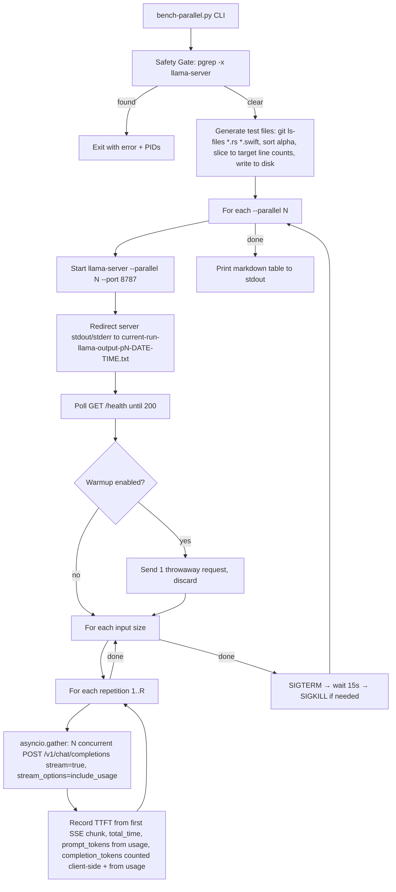
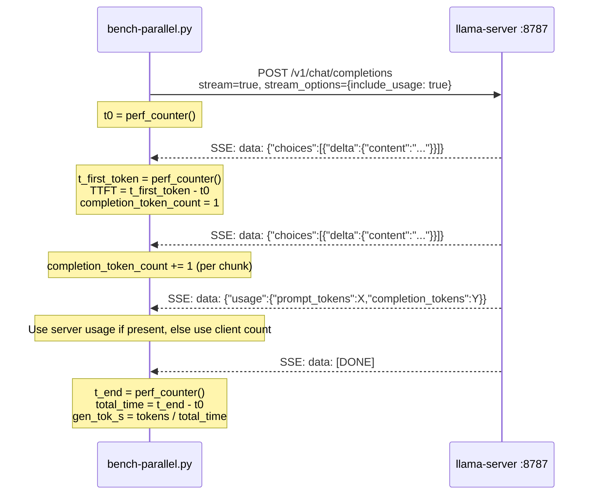

# llama-server Parallel Benchmark

Created by /gauntlette-start on 2026-05-14
Branch: master | Repo: cinderella
Design doc: /Users/robertkarl/.gauntlette/designs/cinderella/parallel-benchmark-design-20260514-120000.md

## Problem Statement

No empirical data on llama-server `--parallel` performance for the bundled Qwen 3.5 9B Q5_K_M model on 18GB Mac hardware. Need hard numbers to set the default `--parallel` value in LlamaServerManager.swift and evaluate whether different models/quants perform better under concurrency.

## Vision

A configurable benchmark script that answers one question: does `--parallel N` help or hurt llama-server throughput for Glass Slipper's workload on consumer Mac hardware? Produces a markdown table of TTFT, generation speed, and amortized throughput across input sizes and parallel slot counts. Reusable for any GGUF model. All test parameters (sizes, parallel values, warmup, repetitions) are CLI-configurable so the tool never needs to be re-run because a parameter was hardcoded wrong.

## Planning Mode

BUILDER — developer tool for internal benchmarking. No users, no UI, no shipping concerns beyond "does it produce correct data."

## Feature Spec

`scripts/bench-parallel.py` — a self-contained Python 3 script.

**Usage:**
```
# Default: 4 sizes (25/250/500/800), parallel 1/2/3, warmup enabled, 3 reps
python3 scripts/bench-parallel.py --model ~/Library/Application\ Support/Glass\ Slipper/Models/Qwen3.5-9B-Q5_K_M.gguf

# Custom server binary
python3 scripts/bench-parallel.py --model ~/models/some-other-model.gguf --llama-server /opt/homebrew/bin/llama-server

# Quick run: 2 sizes, no warmup, 1 rep
python3 scripts/bench-parallel.py --model ... --sizes 250,800 --no-warmup --reps 1

# Compare cold vs warm
python3 scripts/bench-parallel.py --model ... --no-warmup  # run 1
python3 scripts/bench-parallel.py --model ...              # run 2 (warmup enabled)
```

**CLI flags:**
- `--model PATH` (required) — path to GGUF model file
- `--llama-server PATH` — path to llama-server binary (default: auto-detect bundled or /opt/homebrew/bin/llama-server)
- `--sizes LIST` — comma-separated line counts (default: 25,250,500,800). Capped to fit in ctx-size/parallel tokens per slot — see "Context Budget" below.
- `--parallel LIST` — comma-separated parallel values (default: 1,2,3)
- `--reps N` — repetitions per config (default: 3)
- `--no-warmup` — skip warmup request after server start (default: warmup enabled)
- `--port N` — llama-server port (default: 8787)
- `--ctx-size N` — context size (default: 32768)

**Behavior:**
1. Safety gate: check for existing llama-server processes via `pgrep -x llama-server` (exact match), exit with error if found
2. Generate 4 test files from real source code (25/250/500/800 lines) — sized to fit within ctx-size/max-parallel tokens per slot
3. For each --parallel value (1, 2, 3):
   a. Start llama-server with that --parallel value
   b. Wait for /health to return 200
   c. For each input size:
      - Fire N simultaneous "Summarize this code" requests (N = parallel value)
      - Record per-request: TTFT, total time, prompt tokens, completion tokens
   d. Stop llama-server
4. Output markdown table with columns:
   - parallel, input_lines, input_tokens, ttft_avg_ms, ttft_stddev_ms, total_time_avg_s, total_time_stddev_s, gen_tok_s, amortized_tok_s

**Context Budget:** llama-server divides `--ctx-size` evenly across parallel slots. With `--ctx-size 32768` and `--parallel 3`, each slot gets ~10922 tokens. Default input sizes are capped at 800 lines (~6400 tokens) to fit comfortably in the smallest slot. Users with more VRAM can override with `--sizes` and `--ctx-size`.

**TTFT measurement:** Use streaming (`stream: true`) and record time from request send to first SSE data chunk. This is end-to-end TTFT including HTTP client overhead (TCP setup, connection negotiation), not pure server-side TTFT. This matches real-world usage where the client initiates connections.

**Amortized tok/s:** total_completion_tokens_all_requests / wall_clock_time_for_batch. This captures the real throughput when N requests run simultaneously.

## Scope

| Item | Decision | Effort | Why |
|------|----------|--------|-----|
| Safety gate (check for existing llama-server) | ACCEPTED | S | Prevents RAM thrashing on 18GB machine |
| 4 input sizes from real source files (25/250/500/800) | ACCEPTED | S | Representative workload, capped to fit ctx-size/parallel |
| 3 parallel configurations | ACCEPTED | S | Core experiment |
| Streaming TTFT measurement | ACCEPTED | S | Key metric for user-perceived latency |
| Markdown table output | ACCEPTED | S | Easy to paste and compare |
| Reusable --model flag | ACCEPTED | S | Enables testing other models |
| Multiple repetitions per config | ACCEPTED | S | 3 runs for variance control |
| CLI-configurable sizes, parallel, reps | ACCEPTED | S | Two-way door — don't hardcode test parameters |
| Stddev reporting alongside averages | ACCEPTED | S | Can't make decisions from averages alone — need variance |
| Warmup request (on by default, --no-warmup to disable) | ACCEPTED | S | Separates Metal/KV cold-start from steady-state perf |
| Memory usage tracking | DEFERRED | M | Focus on throughput first |
| --parallel 4+ testing | DEFERRED | S | Configurable via --parallel flag, just not default |
| JSON output mode | DEFERRED | S | Markdown is sufficient for now |

## Resolved Decisions

| Decision | Why | Rejected |
|----------|-----|----------|
| Python + asyncio | Best concurrency primitives, precise timing, no compile step | Bash (coarse timing), Rust (overkill) |
| Real source files for test input | Representative of actual Glass Slipper workload | Synthetic text (less representative) |
| Simultaneous requests for concurrency test | Directly measures the real scenario (multiple MCP tools) | Sequential-only (misses the point) |
| Summarize prompt | Matches primary Glass Slipper MCP use case | Code review (heavier), echo (not representative) |
| Safety gate with exit, no auto-kill | User should consciously stop Glass Slipper before benchmarking | Auto-kill (dangerous), ignore (will thrash) |
| All test params CLI-configurable | Two-way door: never re-edit the script to change test matrix | Hardcoded values (would require editing script for each run) |
| Warmup on by default, --no-warmup to disable | Steady-state data by default; cold-start measurable on demand | Always warmup (loses cold data), never warmup (skewed TTFT) |
| httpx with import guard | Best async streaming API, already installed, dev tool doesn't need zero-dep | stdlib urllib (no async, clunky), aiohttp (heavier, no advantage) |
| git ls-files for test input files | Find tracked .rs/.swift files dynamically, self-healing on renames, excludes gitignored artifacts | Hardcoded file list (breaks on refactors), naive glob (picks up target/, build/, worktrees) |
| Server logs to timestamped file | `current-run-llama-output-p{parallel}-{date}-{time}.txt` in CWD for debugging bad runs | /dev/null (loses debug info), stdout (interleaves with table) |
| stream_options + client-side token count | Belt and suspenders: request `include_usage` in stream AND count delta chunks as fallback | Server-only (unreliable across versions), non-streaming re-request (doubles load) |
| Temp files on disk for test inputs | Write sliced source content to temp files on disk | In-memory strings |
| Cap default sizes at 800 lines | ctx-size/parallel must fit each slot; 800 lines ~6400 tokens fits in 32768/3 ~10922 | 2000 lines (overflows slots at parallel>1), scale ctx-size (won't fit 18GB VRAM) |
| git ls-files instead of glob | Excludes gitignored artifacts (target/, build/, worktrees) while remaining self-healing on renames | Naive glob (picks up ~78 junk files) |
| pgrep -x for exact match | Prevents false positives from substring matching | pgrep without -x (matches unrelated processes) |
| End-to-end TTFT (documented) | Matches real-world usage; includes HTTP client overhead by design | Server-only TTFT (requires connection pre-warming, added complexity) |
| Stddev in output table | Can't make config decisions from averages alone; need variance to judge significance | Averages only (can't tell signal from noise) |
| Parallel value in log filename | Prevents collision if iterations complete within same second; easier to correlate | Date-time only (possible overwrites, harder to match logs to config) |
| Sort files alphabetically | Reproducible test input composition across commits | Sort by size desc (composition changes when files are added/removed) |

## Codebase Health

STATUS: HEALTHY

- Stack: Rust (CLI agent) + Swift/SwiftUI (macOS GUI) + Python (benchmark tool)
- Structure: Clean separation between Rust CLI and Swift GUI
- Test coverage: XCTest for Swift, integration tests for Rust
- Documentation: README, CHANGELOG, prior design docs
- Dependency freshness: Current
- Git hygiene: Clean master, feature branches for major work

## Relevant Code

- `glass-slipper/LlamaServerManager.swift:54-63` — current buildArguments (no --parallel flag)
- `glass-slipper/LlamaServerManager.swift:29` — port 8787
- `glass-slipper/LlamaServerManager.swift:87-88` — stdout/stderr to nullDevice (benchmark will redirect to file instead)
- `model-manifest.json` — model definitions with ctx_size, filenames, URLs
- `scripts/` — existing build/package scripts (benchmark script goes here)

## Relevant Design History

- `adaptive-sizing` design — memory-aware model switching, related but different concern
- No prior benchmark tooling

## Open Wounds

None relevant to this work.

## Tech Debt

- `model-manifest.json` has TODO sha256 values for 4B and 35B models
- LlamaServerManager hardcodes model filename instead of reading manifest

## Out of Scope

- Memory profiling during benchmark
- Testing parallel > 3
- Automated CI benchmark runs
- Changing LlamaServerManager defaults (that's a follow-up after we have data)

## Architecture

### Mermaid: Architecture



### Mermaid: Data Flow (Single Streaming Request)



### ASCII: Architecture

```
bench-parallel.py
  │
  ├─ try: import httpx  →  except ImportError: "pip install httpx" + exit(1)
  │
  ├─ Safety gate ── pgrep -x llama-server ──→ exit(1) if found (prints PIDs)
  │
  ├─ Generate test inputs
  │    git ls-files '*.rs' '*.swift' → sort alphabetically → concatenate
  │    slice to [25, 250, 500, 800] lines → write to temp files on disk
  │
  ├─ For parallel ∈ {1, 2, 3} (configurable):
  │    ├─ subprocess: llama-server --parallel N --model M --port 8787 --ctx-size 32768
  │    │    stdout/stderr → current-run-llama-output-pN-YYYYMMDD-HHMMSS.txt
  │    ├─ poll GET :8787/health → 200
  │    ├─ (if warmup) 1 throwaway completion, discard results
  │    │
  │    ├─ For size ∈ {25, 250, 1000, 2000} (configurable):
  │    │    └─ For rep ∈ 1..3 (configurable):
  │    │         └─ asyncio.gather(N × streaming POST /v1/chat/completions)
  │    │              stream_options: {include_usage: true}
  │    │              client-side token counting as fallback
  │    │              └─ measure: TTFT, total_time, prompt_tokens, completion_tokens
  │    │
  │    └─ proc.terminate() → proc.wait(timeout=15) → proc.kill() if needed
  │
  └─ Print markdown table (averages across reps per config)
```

### Failure Matrix

```
Failure                          | What happens             | Plan status
─────────────────────────────────┼──────────────────────────┼──────────────
llama-server already running     | Error + PIDs, exit(1)    | ✓ Safety gate
httpx not installed              | ImportError + install msg | ✓ Import guard
llama-server binary not found    | Sharp edge (crash)       | Acceptable (dev tool)
Model file not found             | Sharp edge (crash)       | Acceptable (dev tool)
/health never returns 200        | Hangs (Ctrl-C)           | Acceptable (dev tool)
Server OOM / crashes on start    | Sharp edge               | Acceptable (dev tool)
Request returns HTTP error       | Sharp edge               | Acceptable (dev tool)
Server exits mid-benchmark       | Sharp edge               | Acceptable (dev tool)
Streaming SSE has no usage chunk | Client-side count used   | ✓ Fallback counting
Server won't die on SIGTERM      | SIGKILL after 15s        | ✓ Kill fallback
```

### Test Matrix

```
Component                | Happy Path | Error Path | Edge Cases | Integration
─────────────────────────┼────────────┼────────────┼────────────┼────────────
Safety gate (pgrep)      |     □      |     n/a    |     n/a    |     n/a
Import guard (httpx)     |     □      |     □      |     n/a    |     n/a
Test file generation     |     □      |     n/a    |     n/a    |     n/a
Server start/health/stop |     □      |     n/a    |     n/a    |     □
Concurrent requests      |     □      |     n/a    |     n/a    |     □
TTFT measurement         |     □      |     n/a    |     □      |     □
Token counting (dual)    |     □      |     □      |     n/a    |     □
Markdown output          |     □      |     n/a    |     □      |     n/a
```

Note: This is a developer tool. Error-path testing is deliberately minimal — sharp edges are acceptable per owner decision.

## Implementation Approaches

### Approach A: Bash + curl
Effort: S, Risk: Low, Completeness: 7/10
Simple but coarse timing and clunky concurrency.

### Approach B: Python + asyncio
Effort: S, Risk: Low, Completeness: 9/10
Clean async, precise timing, streaming TTFT. Recommended.

### Approach C: Rust binary
Effort: M, Risk: Medium, Completeness: 8/10
In-language but overkill for a benchmark tool.

### Recommended
Python + asyncio (Approach B). Best fit for a diagnostic script.

## Implementation

Files to create:
- `scripts/bench-parallel.py` — the benchmark script (~250 lines)

Files to read (for test input generation — now dynamic via glob):
- All `**/*.rs` and `**/*.swift` files in repo, concatenated, sliced to target sizes

Implementation order:
1. Import guard: `try: import httpx` / `except ImportError: print("pip install httpx"); sys.exit(1)`
2. CLI: argparse with --model (required), --llama-server, --sizes, --parallel, --reps, --no-warmup, --port, --ctx-size
3. Safety gate: `pgrep -x llama-server` → exit with PIDs if found
4. Test file generation: `git ls-files '*.rs' '*.swift'`, sort alphabetically by path, concatenate, slice to target line counts (25/250/500/800), write to temp files on disk
5. Server lifecycle: start with `--parallel N`, redirect stdout/stderr to `current-run-llama-output-p{N}-{datetime}.txt`, poll /health, stop cleanly with terminate→wait(15)→kill
6. Request firing: `asyncio.gather(N × httpx.AsyncClient.stream("POST", ...))` with `stream_options: {"include_usage": true}`
7. Metrics collection: TTFT from first SSE `data:` chunk with content, total time via `perf_counter`, completion tokens counted client-side AND from usage block (prefer server, fallback to client count)
8. Output: markdown table with averages and stddev across repetitions

Checkpoints:
1. Safety gate works (detects running llama-server, exits cleanly)
2. Single request with parallel=1 returns valid metrics (TTFT, token counts)
3. Full matrix completes and produces correct table

## Priorities

1. Correct metrics — wrong data is worse than no data
2. Safety gate — must not thrash the machine
3. Reusability — easy to re-run with a different model

## Gauntlette Review Report

| Review | Trigger | Runs | Status | Findings |
|--------|---------|------|--------|----------|
| Planning Kickoff | `/gauntlette-start` | 1 | DONE | Benchmark script design complete. Python + asyncio, 4 sizes x 3 parallel, safety gate for RAM protection. |
| CEO Review | `/gauntlette-ceo-review` | 1 | CLEAR | HOLD scope. Added CLI configurability for all test params and optional warmup request. No scope creep, no kills. |
| Design Review | `/gauntlette-design-review` | 0 | — | — |
| Engineering Review | `/gauntlette-eng-review` | 1 | CLEAR | 5 issues raised, all resolved: httpx with import guard, glob-based test input, server logs to timestamped file, stream_options + client-side token counting, temp files on disk. Sharp edges accepted for dev tool. |
| Fresh Eyes | `/gauntlette-fresh-eyes` | 1 | CLEAR | 8 findings: 1 critical, 4 important, 3 minor. User accepted 7 (ctx-size cap, git ls-files, pgrep -x, TTFT docs, stddev, log naming, alpha sort), skipped 1 (health timeout). |
| Implementation | `/gauntlette-implement` | 1 | DONE | Created `scripts/bench-parallel.py` (527 lines). Import guard, CLI args, safety gate (pgrep -x), test file gen (git ls-files), server lifecycle, concurrent streaming requests with TTFT, dual token counting, markdown table with stddev. Refactored to reduce nesting per user feedback. |
| Code Review | `/gauntlette-code-review` | 1 | PASS | 8 findings total (2 IMPORTANT, 6 MINOR). All accepted/fixed: double-start guard, Ctrl-C cleanup, sample stddev, health timeout, model path dedup, port constant dedup, benchmark auto-detect path, copy-helpers fail-on-missing. |
| QA | `/gauntlette-quality-check` | 0 | — | — |
| Human Review | `/gauntlette-human-review` | 0 | — | — |
| Ship It | `/gauntlette-ship-it` | 1 | DONE | Shipped v0.1.7, 2026-05-14. Squash merged to master. |

**VERDICT:** SHIPPED v0.1.7
